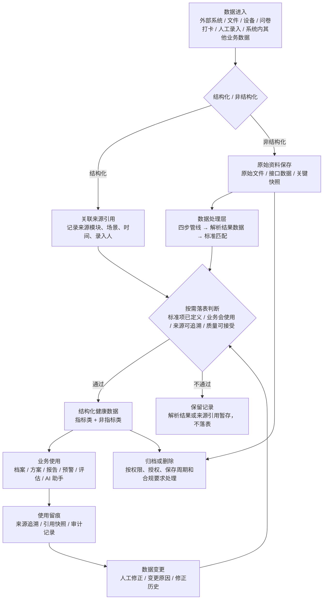
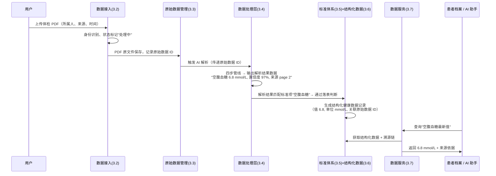

# 健康数据中心产品方案

## 文档导读

本文从产品视角定义”健康数据中心”的建设目标、业务边界、产品原则、能力范围和后续待决策问题，面向研发、产品、实施和业务协作伙伴。
本文面向研发、产品、实施和业务协作伙伴，用于帮助各方理解健康数据中心为什么建设、管理什么数据、提供什么能力、与业务模块如何协作。

本文非技术实现方案，不限定具体数据库模型、服务拆分、接口形式、任务调度方式或系统架构。

 

## 1. 产品概述

### 1.1 简介说明

健康数据中心是一个面向健康管理业务的数据底座能力，用于统一接收、保存、加工、标准化和服务患者相关健康数据。

凡是系统内需要读取、写入、分析或引用健康数据的场景，原则上都应通过健康数据中心形成统一数据口径。

### 1.2 现状问题

现在无统一成型的健康数据中心，各业务模块各自维护与对接，导致问题：

- 同一患者的数据分散在多个模块中，无法形成统一健康视图。
- 同一指标或健康事实在不同模块中口径不一致。
- 同一批数据被不同的业务反复加工，资源浪费。
- AI 使用数据时缺少稳定上下文和可追溯依据。
- 后续新增指标、新增数据源或新增业务场景时扩展成本高。

### 1.3 核心目标

- 把多来源、异构、非标准、非结构化或半结构化的健康数据，沉淀为可查询、可追溯、可治理、可被业务复用的数据资产。

- 健康管理业务在建档、评估、制定方案、随访、报告生成、阶段复盘和 AI 辅助等多个环节反复使用同一批健康数据，

- 健康数据中心构建形成一条从数据进入、原始保留、加工沉淀、业务使用到追溯审计的稳定产品链路。

### 1.4 建设原则

- **原始资料必须保存**：健康数据不能只保存加工后的结果，条件允许时必须保存原始资料数据（条件不允许的情况如医院不允许、合规问题、我们认为的毫无价值的数据等），支撑复核、追溯、重加工和审计。
- **按需沉淀**：健康数据中心不追求全量结构化，只沉淀会被业务使用、需要长期追踪、需要复用或需要审计的数据。具体而言，只有同时满足标准项已定义、业务会使用、来源可追溯、质量可接受，才沉淀为结构化健康数据。
- **AI 结果必须有依据**：AI 参与识别、提取、总结和生成，但关键健康数据必须可回溯原始来源。
- **多来源数据并存**：同一健康指标或健康事实允许多来源数据共存（如院内系统、自行上传报告、设备测量分别记录的空腹血糖），健康数据中心保留所有来源数据及其来源信息，不覆盖。具体业务场景采用哪条数据由业务侧决策，数据中心不管。
- **保持拓展性**：数据标准、处理规则、外部对接方式随业务模块同步升级，新增指标、新增数据源、新增业务场景时可扩展而不推翻已有链路。

### 1.5 建设边界

- 只定义数据中心的能力，不涉及具体业务模块。

- 各业务模块如何与数据中心协同与对接，由业务模块各自负责。同时保持双边同步升级。

## 2. 数据实体与流转

本章建立对健康数据的概览模型，第3章再从系统能力视角展开"需要建设什么"。

### 2.1 数据实体模型

| 实体      | 说明                                      |
| ------- | --------------------------------------- |
| 患者（所属人） | 健康数据的所有者，由患者身份识别统一标识                    |
| 租户      | 数据归属的组织单元，数据默认按租户隔离                     |
| 原始数据    | 进入系统的原始资料（外部文件、接口数据、设备数据、系统内来源记录等），保持原貌 |
| 解析结果数据  | AI 解析原始数据后生成的结构化中间产物，记录识别结果和来源依据        |
| 标准数据项   | 标准数据体系中唯一定义的健康数据单元（指标类或非指标类）            |
| 结构化健康数据 | 已标准化、通过落表判断、可长期复用的正式健康数据                |
| 修正记录    | 对结构化健康数据的人工修改历史（追加写，不覆盖）                |
| 业务引用记录  | 业务模块使用健康数据时的留痕，含引用快照                    |

> 注：租户归属模型详见 [4.3.1 数据归属模型](#4301-%E6%95%B0%E6%8D%AE%E5%BD%92%E5%B1%9E%E6%A8%A1%E5%9E%8B%E4%BA%A7%E5%93%81%E5%BB%BA%E8%AE%AE)。

实体关系：

```
患者(人) ──1:N── 原始数据(文件/payload/来源记录)
原始数据 ──1:N── 解析结果数据(AI 解析结果)
解析结果 ──N:1── 标准数据项(经标准匹配后)
解析结果 ──1:N── 结构化健康数据(通过落表判断后)
结构化健康数据 ──1:N── 修正记录
结构化健康数据 ──1:N── 业务引用记录
标准数据项 ──N:M── 健康管理主题
```

### 2.2 数据流转



**数据流转的四个关键约束**：

- 数据进入后首先判断数据类型：结构化数据直接走来源引用 + 按需落表，不进入 AI 解析链路；非结构化数据先保存原始资料再进入处理层。两条路径仅在按需落表判断处汇合。
- 无论哪种路径，都必须保留来源依据：非结构化数据保留原始资料，结构化数据记录来源引用。这是后续追溯、复核、重加工的基础。
- 只有通过按需落表判断的数据，才沉淀为结构化健康数据。未通过的数据保留记录（解析结果或来源引用），不落表。
- 健康数据被业务使用后，必须能够记录引用、支持修正，并按权限和合规要求处理归档或删除。

**数据实体与系统能力的映射：**

上述实体和流转阶段，对应第3章的各项产品能力：

| 数据视角（本章）       | 对应系统能力（第3章）            |
| -------------- | ---------------------- |
| 数据进入、患者身份识别    | 3.2 数据接入能力             |
| 原始数据保存、来源引用管理  | 3.3 原始数据管理能力           |
| 解析结果数据生成、AI 解析 | 3.4 数据处理层能力            |
| 标准数据项定义、行业对标   | 3.5 标准数据体系能力           |
| 结构化健康数据沉淀      | 3.6 结构化健康数据能力          |
| 业务取数、AI 上下文供给  | 3.7 数据服务能力             |
| 修正、引用留痕、溯源审计   | 4.1 + 4.2 + 4.3 治理与安全层 |

### 2.3 数据旅程示例

以下用一份体检 PDF 从上传到被业务使用的完整旅程作为示例。

> **场景**：患者上传一份体检 PDF，系统需要识别其中的"空腹血糖 6.8 mmol/L"，最终供 AI 助手和患者档案使用。



关键节点说明：

- **接入即留存**：PDF 上传后，原始文件第一时间保存，后续所有操作基于原始数据 ID 关联，不直接修改原始文件。
- **解析结果不落表**：AI 解析出的"解析结果数据"是中间产物，只有通过标准匹配和落表判断后才成为结构化健康数据。
- **溯源链完整**：业务取到的"6.8"可沿结构化数据 → 解析结果数据 → 原始 PDF（page 2）完整回溯。
- **规则升级可重加工**：后续如果空腹血糖的标准单位或匹配规则调整，可基于同一份原始 PDF 重新生成解析结果数据，不影响已有数据。

> 注：此示例只展示一条成功路径。实际系统中还存在低置信度路由到人工处理、未匹配到标准项暂存解析结果数据、多来源数据并存等分支路径，详见对应能力章节。

## 3. 核心能力

本章定义健康数据中心需要建设的产品能力。”能力”不等同于系统模块，研发可根据架构选择实现方式。

以下将 10 项产品能力归入 6 个逻辑层，与第2章数据视角的对应关系见 [2.1 末尾的映射表](#21-数据实体模型)。

### 3.1 能力模块概览

```mermaid
block-beta
  columns 1
  block:gov
    gov[“**全局管控层**（贯穿各层）
    4.1 规则配置与治理 · 4.2 溯源、修正、引用与审计 · 4.3 权限、授权与数据边界
    为每一层提供规则、追溯和安全保障”]
  end
  space
  block:svc[“**数据服务层**
  3.7 数据服务能力
  统一对外供给原始数据、解析结果、结构化数据、溯源信息和 AI 上下文”]
  space
  block:asset[“**数据资产层**
  3.5 标准数据体系能力 · 3.6 结构化健康数据能力
  定义可复用资产，管理已沉淀的结构化健康数据”]
  space
  block:process[“**数据处理层**
  3.4 数据处理层能力
  承接非结构化数据，生成解析结果数据并完成标准匹配”]
  space
  block:storage[“**数据存储层**
  3.3 原始数据管理能力
  统一管理原始数据，保留来源依据，保持原貌不修改”]
  space
  block:access[“**数据接入层**
  患者身份识别 · 3.2 数据接入能力
  多来源健康数据的统一入口”]
```

系统各层统一以「患者主索引ID + 来源溯源ID + 时间戳」为核心查询维度，各层在此基础上扩展层内特有维度（如接入方式、资料类型、数据类型等），不再逐层重复声明。

| 能力模块            | 子能力         | 解决的问题          | 核心要求                             |
| --------------- | ----------- | -------------- | -------------------------------- |
| **数据接入**（3.2）   | 患者身份识别      | 数据属于谁          | 多要素递进匹配，未匹配保留候选记录                |
|                 | 多源接入管理      | 数据从哪来、怎么来      | 覆盖 6 种接入方式，记录来源渠道和接入状态           |
| **原始数据管理**（3.3） | 原始数据储存      | 原始数据和来源依据如何保留  | 保留原始资料或稳定来源引用，支撑回看、复核和重加工        |
| **数据处理**（3.4）   | 数据结构化       | 如何从非结构化中提取信息   | 四步管线，输出解析结果数据，逐字段标注置信度和来源依据      |
|                 | 标准化匹配       | 各种叫法如何统一到一个标准名 | 匹配优先级链 + 置信度路由，未匹配项保留            |
|                 | 落表判断        | 哪些数据值得沉淀为正式资产  | 按需落表规则裁决，不通过的数据保留在解析结果数据中        |
| **数据资产**（3.5）   | 标准数据体系      | 数据"应该长什么样"     | 两大类七子类，属性模型完整，与行业标准对标            |
|                 | 结构化健康数据     | 已沉淀数据如何管理      | 多来源并存、历史追踪、修正留痕                  |
| **数据服务**（3.6）   | —           | 健康数据如何统一对外供给   | 统一供给原始数据、解析结果、结构化数据、溯源信息和 AI 上下文 |
| **治理与安全**（4.x）  | 规则配置与治理     | 规则和问题如何持续维护    | 规则维护、处理结果查看、问题追踪、配置启停            |
|                 | 溯源、修正、引用与审计 | 数据使用后如何可解释     | 来源追溯、修正留痕、引用快照、操作审计              |
|                 | 权限、授权与数据边界  | 健康数据如何被安全使用    | 租户隔离、授权访问、权限分级、归档删除              |

### 3.2 数据接入模块

能力目标：定义哪些健康数据可以进入健康数据中心，以及如何进入、如何记录来源、如何跟踪接入过程。

边界说明：数据接入是健康数据中心的统一入口，负责接收、校验、来源记录和状态管理。结构化数据接入后进入按需落表链路，非结构化数据进入数据处理层。

#### 3.2.1 多源接入管理

**接入原则**（什么能进、什么不能进）：

- 【允许】健康档案核心数据（病历资料、健康数据等数据）。
- 【允许】健康管理业务会复用、追踪、分析、引用或审计的数据。
- 【允许】系统内结构化数据可直接接入，遵循按需落表。
- 【限制】纯业务过程状态不构成健康事实的数据
- 【限制】临时计算结果无需追溯的数据；
- 【限制】与健康管理无核心相关的运营、营销、流程或权限数据。
- 【待定】用户行为等数据（按业务需要再定）

**主要的来源渠道与数据种类**

| 来源渠道      | 主要数据种类                              | 主要数据格式                                   | 接入方式                      | 关键机制                                                                |
| --------- | ----------------------------------- | ---------------------------------------- | ------------------------- | ------------------------------------------------------------------- |
| 外部信息系统    | 就诊人基础档案数据、病历档案、检验检查报告、体检报告、处方等      | JSON、PDF、XML、图片（图片通常是检查报告附件，如超声报告中的若干图片） | API                       | 系统主动向外部拉数据（院内通常不做推送，需定时拉取，不同医院入参差异极大）                               |
| 系统内部病历资料  | 同外部系统数据种类基本一致                       | 图片、PDF                                   | 系统内写入                     | 前台功能上传后直接归档到数据中心，无需经过归属患者识别（前台已指定归属患者）                              |
| 物联设备      | 身体体征或检测检验数据：血压、血糖、体重、体脂、运动、睡眠等      | 字符串（厂商提供解析规则，需自行解析）                      | 云端 API / 设备蓝牙直传（由系统内业务写入） | 不同接入方式数据流转路径有差别，技术设计上需做好兼容；解析需按厂商-设备型号定制，无法通用；需记录设备、采集时间、单位、频率和厂商来源 |
| 系统内其他业务数据 | 问卷填写、智能/人工外呼（通话录音+AI转写）、打卡记录、任务执行结果 | 结构化字段 + 文本/音频文件                          | 系统内写入                     | 场景很多情况太复杂，需要逐个业务进行消化；核心原则：结论性数据进入数据中心，过程性数据放在业务（方向性界定，待进一步理清）       |

#### 3.2.2 外部系统对接专门说明

外部系统（尤其是院内系统）是健康数据的主要来源，也是健康数据中心所有接入渠道中最不可控的一类。以下从问题、策略、保障和状态流转四个层面说明，核心目标降低异常风险情况发生。

**对接存在的问题**

- 对方不推送：院内系统通常不支持主动推送数据，需要我方定时拉取，数据时效性取决于拉取频率。
- 接口无标准：不同医院、不同厂商的接口入参、返回格式、分页方式、错误码体系各不相同，无法用一套通用逻辑覆盖。
- 稳定性不可控：院内系统存在负载高峰、网络抖动、接口变更不通知等情况，存在拉取中断、超时导致拉取异常（漏拉或无法拉取）。
- 数据完整性难验证：对方是否返回了全部数据、是否有遗漏，仅靠技术手段无法百分之百确认——我们只能感知"与预期的偏离"，无法感知"对方有而我不知的数据"。

**对接策略**

- 对接粒度：由字段级对接调整为获取完整院内原始数据（文档/报告/payload），由数据中心自行解析、识别和标准化。如客户仅能提供字段级数据，也须同步记录字段来源、来源系统和对应文档关系。
- 对接前摸底：与医院信息科确认数据量级、更新频率、接口能力边界，作为后续比对和异常判断的基线参考。
- 拉取模式：系统主动向外部系统拉数据（院内通常不做推送），需支持定时拉取，按来源系统独立配置拉取窗口和频率。

**拉取保障**

- 拉取控制：按来源系统配置调用间隔和并发上限，支持分时间窗口、分数据类型增量拉取，避免瞬时高并发拉爆对方系统。
- 完整性校验：每次拉取完成后比对实际收到数据与预期数据——对方返回的 totalCount 等元信息、历史同期的数据量基线、关键字段缺失率。出现显著偏离时触发告警。
- 异常重试：校验未通过或拉取中断 → 自动进入重试队列，采用递增退避间隔；多次重试仍失败 → 标记"部分完成"，已拉数据先保存可用，未拉到的缺口明确记录，转人工介入。

#### 3.2.3 数据归属患者策略

多来源数据进入后，须通过身份识别关联到正确的所属人。

系统内产生的数据天然知晓数据归属，这里核心是针对从外部系统获取的数据的归属确认。采用多要素递进确认模型：

- 第一层（确定性匹配）：身份证号精确匹配，通过后直接关联。
- 第二层（高概率匹配）：姓名 + 性别 + 出生日期三元组加权相似度匹配，达标自动关联。
- 第三层（扩展匹配）：手机号、地址、院内就诊卡号等辅助判定，落入置信度区间时触发人工复核。
- 未关联患者的数据仍需要保存下来（备用）

特别说明：患者身份识别的最终策略依赖 [5.0 最高优先级决策](#50-最高优先级决策) 的确认结果。

### 3.3 原始数据管理模块

能力目标：统一管理进入健康数据中心的原始数据，保留数据来源依据，支撑回看、复核、追溯、审计和后续重加工。**保存只是手段，保全和可追溯才是目的。**

边界说明：

- 负责原始数据的接收、保存和索引，确保原始数据一旦保存不可修改，并向下游提供可追溯的关联锚点。

- 本层不触发 AI 解析任务，不负责解析结果数据的存储。

- 纯结构化值（如打卡记录的数值、人工录入的测量值）不经过本层，落表时直接挂来源引用即可。

#### 管理对象

- 见接入模块说明。
- 系统内业务场景产生的数据，具体边界仍需进一步确定（结构化的数据肯定存放在本模块）

#### 管理原则

- **完整性**：外部来源必须完整保留原始资料，不以加工后的字段替代。
- **不可变性**：原始数据保存后即为只读，任何后处理动作都不能反写修改原始数据。
- **可追溯性**：每一条原始数据必须记录所属人、来源渠道、来源系统/场景、来源时间、~~接入批次~~和资料类型，同时与下游解析结果数据、结构化健康数据、业务引用记录建立关联。

#### 存储策略

原始数据采用”统一索引 + 分类型存储”：

- 统一索引：所属人（存在无所属人情况）、来源渠道、来源系统、资料类型、接入方式、接入批次、接入时间、处理状态和关联关系。

- 类型示例：
  
  - 病历资料
  - 物联数据原始数据
  - 问卷采集原始数据
  - 外呼录音文件
  - 等等（后续随业务接入持续补充）

- 原始内容要求能通过统一索引被检索、回看和追溯。

- 新增数据来源或数据格式时，优先归入已有类型，已有类型无法容纳时，按业务含义新增类型

**与处理层的衔接**

- 原始数据保存完成后由处理层读取，本层不负责解析任务的触发和调度。
- 处理层生成的解析结果数据独立存储，不与原始数据混存。
- 解析结果数据通过原始数据 ID、页码、区域、字段路径、原文片段等信息关联回原始数据。
- 同一份原始数据可被多次解析，支持后续规则升级、模型迭代时重新处理。

### 3.4 数据处理模块

能力目标：将非结构化数据转为解析结果数据；在此基础上完成标准匹配与落表判断。

边界说明：包含两个子模块

- **数据结构化子模块**：负责将非结构化数据转为解析结果数据，回答"文档里写了什么"；

- **数据标准化子模块**：负责将解析结果数据匹配到标准项并判断是否落表，回答"对应哪个标准项、该不该落表"。

- 两者解耦：可实现基于结构化结果多次出发执行标准化，不需要重跑整条管线。

特别说明：本模块不负责定义<mark>需要</mark>处理哪些数据，具体由业务定义。

#### 3.4.1 数据结构化

| 步骤       | 说明                                                       |
| -------- | -------------------------------------------------------- |
| 1. 预处理   | 格式归一化、图片增强、编码转换，输出标准化文档页面                                |
| 2. 文本抽取  | 数字 PDF 直接提取文本，扫描件/拍照件走 OCR，OCR 结果经语义校正，输出全文文本            |
| 3. 数据结构化 | 从全文中抽取医学实体及属性，语境检测；按抽取结果组装 JSON，标注置信度和来源依据，原文回验。输出解析结果数据 |
| 4.保存与 输出 | 解析结果数据保存，传递至数据标准化子模块                                     |

#### 3.4.2 标准化处理

结构化完成之后，本环节核心实现：匹配到哪个标准项、质量是否过关、是否需要落表。

**标准匹配与标准化**：系统判断”应该标准化成什么名称”，不能只靠 AI 猜测，应优先依赖标准数据体系和规则配置。

匹配顺序（由确定性高到低）：

```text
来源映射规则
-> 标准名称/编码精确匹配
-> 别名、缩写、同义词匹配
-> 结合单位、值类型、业务主题辅助匹配
-> AI 辅助判断
-> 未匹配则保留解析结果
```

**标准化涵盖六个维度：**

- ****名称（统一到标准项）

- 值类型（数值/范围/阴阳性/文本/枚举）

- 时间（区分检测/报告/上传/记录时间）

- 来源（基于管线输出的来源依据做来源类型分类）

- 质量状态（基于管线输出的置信度和语境检测结果做状态判定）

- 单位（当前阶段保留原始单位，不做统一换算，后续再确认）。

**置信度策略：**

- 研发评估，主要是想实现达到一定的置信度之后才能自动落表，否则拦截（后续支持人工接入判断）

**落表策略**：

不是所有解析结果项都落表，须同时满足以下条件才沉淀为结构化健康数据：

- 标准项已定义：能匹配到标准数据项

- 质量可接受：值、单位、时间、人员归属等关键要素完整

- 来源可追溯：能回到原始数据或来源记录

核心原则还是按需定义落表归档，不满足条件的数据保留解析结果数据及失败原因，避免后续无法重加工。

**实现注意**：

- 已映射结构化数据由接入层分流至按需落表链路，不经 AI 解析管线；

- 同一指标多来源并存，不在处理层简单覆盖；处理过程记录模型版本、规则版本、处理批次。

- 人工确认可作为后续增强能力，用于低确定性匹配、重要数据复核和规则沉淀，当前阶段不作为必需流程。

- 领域微调的中文医疗模型在中文医疗文档上的表现显著优于通用大模型，选型时应优先考虑。

### 3.5 标准数据体系能力

能力目标：建立统一健康数据口径，形成 AI 可依循的标准化知识库，使不同来源、不同名称、不同格式的健康数据能够被识别、归一、追踪和复用。

边界说明：本能力定义标准数据项的命名、分类、单位和关联关系。

#### 3.5.1 标准数据分类体系

标准数据项分为两大类、七子类：

**一、指标类数据**（可量化的测量/检验结果）

| 子类        | 范围             | 典型数据项                                           |
| --------- | -------------- | ----------------------------------------------- |
| 1.1 体格测量  | 生命体征和身体测量      | 收缩压、舒张压、心率、身高、体重、BMI、腰围                         |
| 1.2 实验室检验 | 血液、尿液等标本的实验室检测 | 空腹血糖、糖化血红蛋白、总胆固醇、甘油三酯、HDL-C、LDL-C、尿酸、肌酐、ALT、AST |
| 1.3 设备测量  | 家用或可穿戴设备采集数据   | 血糖仪读数、血压计读数、体脂秤数据、运动手环步数/心率                     |

**二、非指标类数据**（健康状态/事实的定性记录）

| 子类            | 范围             | 典型数据项                                    |
| ------------- | -------------- | ---------------------------------------- |
| 2.1 疾病史与诊断    | 既往病史、现病史、家族史   | 高血压病史、糖尿病病史、冠心病病史、肿瘤史、传染病史（参考 ICD-11 分类） |
| 2.2 用药记录      | 当前用药、用药史、过敏药物  | 药品名称、剂量、用法、起止时间（参考医保药品编码 YB）             |
| 2.3 手术与操作史    | 手术史、操作记录       | 手术名称、手术日期、操作记录（参考 ICD-9-CM3）             |
| 2.4 生活方式与健康标签 | 生活习惯、风险标签、问卷结果 | 吸烟状况、饮酒频率、运动频率、饮食结构、睡眠质量、风险标签、问卷量表结果     |

#### 3.5.2 标准数据项属性模型

每个标准数据项至少包含以下属性：

| 属性       | 说明                          | 示例（空腹血糖）                    |
| -------- | --------------------------- | --------------------------- |
| 标准名称     | 系统内唯一的标准中文名称                | 空腹血糖                        |
| 标准编码     | 系统内标准编码，可参考 WS/T 363 DE 标识符 | DE04.50.001.00              |
| 别名/同义词列表 | 可被匹配的替代名称和缩写                | [FPG, 葡萄糖(空腹), GLU, 空腹血糖测定] |
| 数据分类     | 所属类别（1.1-2.4 分类体系）          | 1.2 实验室检验                   |
| 数据类型     | 数值型 / 枚举型 / 文本型 / 范围型       | 数值型                         |
| 标准单位     | 系统内存储的参考单位（当前阶段不做强制换算）      | mmol/L                      |
| 值域约束     | 正常参考范围或允许取值                 | 3.9-6.1 mmol/L              |
| 关联健康主题   | 属于哪些健康管理主题（可多选）             | [代谢管理, 糖尿病管理, 心血管管理]        |
| 启用状态     | 是否在当前业务范围内启用                | 已启用                         |
| 来源映射规则   | 已知来源系统的字段名映射（可选）            | HIS_X: GLU_F; 报告模板A: 空腹血糖测定 |

#### 3.5.3 行业标准对标

标准数据体系的建设不独立另起炉灶，而是以国家卫健委已颁布的标准体系为基础进行筛选和补充。下表列出标准数据体系与已有行业标准的对标关系：

| 健康数据类别           | 对标标准                     | 覆盖内容              | 引用方式                 |
| ---------------- | ------------------------ | ----------------- | -------------------- |
| 体格测量（血压、BMI 等）   | WS/T 363.7、WS 365        | 数据元名称、数据类型、单位、值域  | 直接引用数据元定义            |
| 实验室检验（血糖、血脂、尿酸等） | WS/T 363.9、WS 446（LOINC） | 检验项目名称、编码、标本类型    | WS 446 编码 + LOINC 映射 |
| 疾病诊断             | ICD-11 中文版               | 疾病分类、编码、层级关系      | 直接引用编码和层级            |
| 用药记录             | 医保药品编码（YB）               | 药品名称、ATC 分类、剂型、规格 | 直接引用编码和分类            |
| 手术操作             | ICD-9-CM3（医保版）           | 手术分类、编码、层级        | 直接引用编码和层级            |
| 问卷量表             | WS 365、WS/T 483          | 慢性病随访数据集          | 部分引用 + 自有扩展          |
| 医学术语补充           | OMAHA 七巧板术语集             | 105 万+概念、140 万+术语 | 作为同义词库和未匹配 fallback  |

提示：具体标准编号、名称和详细对标关系见附录 A"行业标准对标清单"。

#### 3.5.4 AI 标准化的知识库输入

标准数据体系同时作为 AI 标准化处理的知识库基底：

- 在标准匹配阶段（见 3.4.3），系统按匹配优先级链执行：来源映射规则 → 标准名称/编码精确匹配 → 别名/同义词匹配 → 辅助属性匹配 → AI 辅助判断。AI 辅助判断作为兜底机制，仅在前序规则无法匹配时介入。
- 高频未匹配项（同一原始名称反复出现但无法匹配到任何标准数据项）应自动提示是否需要新增标准数据项，支持标准体系的持续扩展。
- 标准数据体系变更（新增标准项、停用旧标准项、更名）后，支持对历史解析结果数据触发重加工，基于新规则重新匹配。

#### 3.5.5 标准体系的建设方式

标准数据项的具体筛选，以 [3.5.3 行业标准对标](#353-行业标准对标) 所列标准为总池，按业务实际使用频率和必要性逐项选取。第一批覆盖范围见 [5.1 数据范围与优先级](#51-数据范围与优先级)。

建设方式：

- 按业务需求按需建设，不追求一次性覆盖所有健康数据项。
- 优先建设会被档案、方案、报告、预警、评估、AI 调用的数据项。
- 第一批建议覆盖：血压、血糖、血脂、尿酸、体重形态（指标类），以及病史、用药、过敏、生活方式、标签（非指标类）。
- 标准数据项、别名、分类和来源映射前期以人工维护为主。
- 后续可基于解析结果数据中未匹配的高频项，自动推荐新增标准数据项，逐步降低人工维护成本。
- 标准数据体系随业务场景、数据来源和管理主题的扩展持续增量建设。

### 3.6 结构化健康数据能力

能力目标：沉淀已完成标准化、且具备业务使用价值的结构化健康数据，形成可长期追踪和复用的数据资产。

边界说明：本能力管理已通过落表判断的标准化健康数据，支撑长期追踪和修正。

与其他能力的关系：

- 上游依赖：标准数据体系（3.5）提供标准化依据；数据处理层（3.4.1）提供解析结果数据、（3.4.3）提供落表判断结果。
- 下游供给：数据服务能力（3.7）通过本层获取结构化数据对外供给；溯源修正（4.2）以本层数据为基础记录修正和引用。

关键要求：

- 支持指标类数据沉淀，例如血压、血糖、血脂、尿酸、体重形态等。
- 支持非指标类健康数据沉淀，例如病史、用药、过敏、生活方式、标签、问卷结果、设备结果等。
- 同一数据项允许多来源并存，保留来源、时间、质量状态和处理状态。
- 支持历史记录保留，支撑趋势、阶段对比和长期健康管理。
- 支持人工修正、修正原因和修正历史记录。
- 保留业务取数所需的基础信息，例如最新值、指定来源值、指定时间范围值和业务场景指定值。

> 第一批纳入的数据范围待 [5.1 数据范围与优先级](#51-数据范围与优先级) 确认。

### 3.7 数据服务能力

能力目标：面向业务模块、AI 能力和管理端，统一提供健康数据中心内所有健康数据的对外供给能力。

服务对象：

- 患者档案、健康方案、报告、预警、阶段评估等业务模块。
- AI 助手、AI 报告生成、AI 风险分析等智能能力。
- 运营管理端、数据治理端和问题排查场景。

供给范围：

- 原始数据：原始资料（外部文件、接口数据、上传资料等）及来源记录。
- 解析结果：AI 解析结果、未匹配结果、处理失败结果、待重加工结果。
- 结构化数据：已标准化、已沉淀、可长期复用的健康数据。
- 过程信息：接入状态、处理状态、质量状态、规则版本、修正记录。
- 溯源信息：来源系统、原始资料位置、证据片段、业务引用记录。
- AI 上下文：用于 AI 分析、解释和生成内容的数据包及来源依据。

关键要求：

- 支持按数据类型、业务场景查询健康数据。
- 支持按最新值、指定来源、指定时间范围、指定业务场景返回数据。
- 支持系统内业务场景写入健康数据，例如问卷、打卡、自测、人工录入、人工标记标签等。
- 支持业务查看数据来源、质量状态、修正记录和引用记录。
- 支持 AI 获取结构化数据、原始证据和必要上下文，避免只给结论不给依据。
- 支持按业务场景组织返回结果，降低各业务模块重复拼装数据的成本。

边界说明：数据服务能力统一对外供给健康数据及其来源依据。

## 4. 治理、溯源与安全

### 4.1 规则配置与治理能力

能力目标：支撑健康数据中心的标准、规则、配置和质量问题持续维护，确保规则可维护、问题可追踪、结果可解释。

边界说明：治理能力的重点是规则可维护、问题可追踪、结果可解释。覆盖标准体系治理、处理规则治理和质量问题治理。

与其他能力的关系：本能力贯穿数据处理层（3.4）、标准数据体系（3.5）和结构化健康数据（3.6），为这些能力提供规则配置、结果查看和问题追踪支撑。

核心能力：

- 标准体系治理：支持标准数据项、别名、分类、来源映射和启停状态的配置管理。
- 处理规则治理：支持接入规则、解析规则、标准匹配规则和落表规则的配置、版本管理和生效范围控制。
- 处理结果查看：支持按数据类型、状态查看接入、解析、标准匹配和落表的处理结果。
- 问题追踪：支持失败原因、异常结果、待处理结果和未匹配结果的查询和追踪。
- 前期可由研发维护规则，后续按需要开放可视化配置能力。

数据质量维度参考：

健康数据中心的数据质量从以下五个维度进行度量和监控：

| 质量维度 | 定义                    | 判定方式          | 适用阶段      |
| ---- | --------------------- | ------------- | --------- |
| 完整性  | 关键字段（值、单位、时间、所属人）是否齐全 | 规则自动检测        | AI解析后、落表前 |
| 准确性  | 提取值与原始资料原文是否一致        | AI 置信度 + 抽样校验 | AI 解析后    |
| 一致性  | 同一指标多来源时口径是否对齐        | 标准匹配结果        | 标准化后      |
| 时效性  | 数据采集/报告时间是否在业务有效期内    | 时间戳比对         | 业务使用前     |
| 可追溯性 | 是否能回到原始资料位置           | 来源关联完整性检查     | 全链路       |

### 4.2 溯源、修正、引用与审计能力

能力目标：保证健康数据被使用后仍可解释、可复核、可追溯。

边界说明：本能力覆盖数据引用留痕、修正追溯和操作审计的后链路。

与其他能力的关系：

- 上游依赖：原始数据管理（3.3）提供来源依据；结构化健康数据（3.6）提供需要修正和引用的数据对象。
- 下游供给：数据服务能力（3.7）在对外供数时同步输出溯源信息；权限审计（4.3）依赖本能力的审计日志。

核心能力：

溯源：

追溯的终点不是文件，而是来源依据。数据类型不同，追溯路径和结果也不同：

**非结构化数据溯源**（如体检 PDF 中的空腹血糖值）：

- 路径：结构化健康数据 → 解析结果数据 → 原始资料位置（页码、区域、原文片段）
- 业务看到的追溯结果示例：「该值提取自 2026-05-10 体检报告第 3 页，原文：空腹血糖 6.8 mmol/L」

**结构化数据溯源**（如患者打卡录入的体重）：

- 路径：结构化健康数据 → 来源记录（来源模块、录入场景、录入人、录入时间）
- 业务看到的追溯结果示例：「该数据来源于 2026-05-13 患者自行打卡录入，BMI 打卡模块」

系统需支持从结构化健康数据、解析结果和业务引用结果，沿对应路径回溯到来源依据。无论哪种路径，追溯结果都应包含：数据从哪来、什么时候记录的、原始值是什么、是否有过修正。

修正：

- 支持人工修正结构化健康数据，并记录修改前值、修改后值、修改人、修改时间和修改原因。
- 修正记录以追加方式写入，不直接覆盖原值，保证修正历史可追溯。
- 人工修正是否必须填写原因、是否需要审核，由后续业务决策确认。

引用：

- 支持业务引用留痕：记录哪些报告、方案、预警、评估、AI 内容使用了哪些健康数据。
- 建议保留引用快照（引用时刻的数据副本），避免源数据后续变化后无法解释历史业务结果。
- 已引用数据发生变化后，是否需要提醒业务人员，由后续业务决策确认。

审计：

- 支持关键操作审计：查看原始资料、修改数据、导出数据、引用数据等操作应记录操作人、操作时间、操作内容和结果。
- 审计记录不可篡改，支持按人员、时间、操作类型查询。

> 修正锁定策略、引用快照保留周期等待 [5.4 溯源、修正与引用](#54-溯源修正与引用) 确认。

### 4.3 权限、授权与数据边界能力

能力目标：确保健康数据在多租户、多角色、多业务场景下被合规访问和使用。

边界说明：本能力定义产品层面的权限边界、授权规则和合规要求。

#### 4.3.1 数据归属模型（产品建议）

当前阶段建议采用"租户归属为主 + 患者授权共享为辅"的模型：

- 默认规则：健康数据属于采集/生成该数据的租户，各租户数据相互隔离。
- 患者权利：患者有权查看、导出其在各租户的个人健康数据，有权申请更正错误数据。
- 跨租户共享：同一患者在多个租户产生数据时，经患者明确授权后，可在指定租户间共享指定范围内的数据。共享通过授权令牌控制，全程审计可追溯。
- 全局身份：患者主索引全局唯一（跨租户），用于跨租户身份解析和授权判断；但数据按租户分区存储，未经授权不跨租户流通。
- 演进方向：此模型可后续向"患者归属 + 授权访问"方向演进，当前阶段以租户归属作为工程基线更可控。

#### 4.3.2 合规基线

健康数据属于《个人信息保护法》第 28 条定义的敏感个人信息，处理需满足以下要求：

- 处理目的特定且必要，需取得个人的单独同意。
- 进行个人信息保护影响评估（PIPIA）后方可处理。
- 原始资料（含患者身份信息）的查看权限应高于结构化数据的查看权限。
- 数据删除、归档需符合保存周期和合规要求，支持按租户、按数据类型、按时间范围配置策略。
- 关键操作（查看原始资料、修改数据、导出数据、引用数据）应完整审计，记录操作人、操作时间、操作内容和结果。

#### 4.3.3 角色与权限分级

- 支持租户级管理员、机构管理员、医生、患者等不同角色的数据访问边界。
- 支持原始资料、结构化数据、解析结果、业务引用记录设置不同权限等级。
- 支持患者授权、撤回、查看、删除或申请更正等产品规则预留。
- 支持跨租户服务同一人员时的数据归属、共享和隔离规则。
- 支持按权限、授权、保存周期和合规要求进行归档和删除。

> 数据归属模型、角色权限分级的最终形态依赖 [5.5 权限与租户](#55-权限与租户) 的确认结果。

## 5. 后续待决策问题

以下问题需要在下一轮产品和研发协作中继续确认。这些问题的决策存在先后依赖关系：建议优先确定数据归属和租户隔离原则（5.5），在此基础上确定数据范围与优先级（5.1）、溯源修正的锁定策略（5.4），最后确定异常数据处理流程（5.3）和业务使用方式（5.2）。

### 5.0 最高优先级决策

以下三项建议在下一轮会议优先确认，因为后续数据模型设计、权限模型设计和接口设计均依赖这些判断：

1. **数据归属模型**：是否采用"租户归属为主 + 患者授权共享为辅"？还是直接走向"患者归属"模型？
2. **患者主索引策略**：全局唯一患者 ID 由哪些字段构成？身份证号为锚定字段是否确认？身份匹配的自动/人工阈值如何设定？
3. **原始资料保存周期**：永久保存还是有期限？合规要求的最短保存周期是多少？（参考：HIPAA 基准为 6 年，国内要求需与法务确认）

### 5.1 数据范围与优先级

- 第一批必须纳入健康数据中心的数据范围是什么。
- 第一批标准数据项是否围绕血压、血糖、血脂、尿酸、体重形态，以及病史、用药、过敏、生活方式、标签等高频数据建设。
- 问卷、打卡、自测、人工录入数据中，哪些需要结构化沉淀，哪些只保留来源引用。
- 设备数据是否属于高频数据，业务是否需要原始明细和汇总结果同时保留。

### 5.2 业务使用方式

- 业务是否需要跨指标、跨来源、跨时间查询健康数据。
- 业务模块取数时，是否需要区分最新值、指定来源值和业务指定值。
- AI 使用健康数据时，是否必须展示来源依据。

### 5.3 处理状态与后续升级

- 异常或未匹配的数据如何提示给业务人员。
- 处理失败后由谁处理，是否需要重新提交或人工补录。
- 历史原始资料重新处理后，是否自动更新已有结构化健康数据。
- 后续是否需要引入人工确认流程，用于重要数据复核、低确定性匹配和规则沉淀。
- 单位标准化和单位换算规则是否需要建设，以及何时启用。

### 5.4 溯源、修正与引用

- 原始资料是否永久保存，是否存在保存周期。
- 报告引用数据后，是否需要锁定当时值。
- 数据被人工修正后，历史报告、方案或评估是否同步变化。
- 人工修正是否必须填写原因，是否需要审核。
- 已引用数据发生变化后，是否需要提醒业务人员。

### 5.5 权限与租户

- 平台级数据底座和租户数据隔离的最终产品原则是什么。
- 跨租户服务同一个人时，数据归属如何定义。
- 患者授权、机构授权和医生授权之间如何区分。
- 原始资料查看权限是否高于结构化数据查看权限。
- 数据删除、归档的产品规则是什么。

## 6. 当前结论摘要

健康数据中心的建设重点不是先做某个页面，而是建立一套可持续扩展的数据底座能力。

这套能力需要解决五件事：

1. 多来源健康数据能够进入系统，并尽可能保留原始资料、原始数据或稳定来源引用。
2. 非结构化资料和外部原始数据能够被识别、提取、标准匹配，并按业务价值形成结构化健康数据。
3. 原始数据、解析结果和结构化健康数据能够被患者档案、健康方案、报告、预警、评估和 AI 统一调用。
4. 健康数据被使用时，能够追溯来源、记录引用、支持修正和审计。
5. 健康数据中心只定义统一数据能力和产品边界，不替研发限定具体实现方式，也不替业务模块做最终业务判断。

只有这些底座能力稳定后，健康方案、预警监测、报告生成、阶段评估、AI 助手和 C 端展示才能共享同一套稳定统一的健康数据口径。

**阶段性可验证的建设目标：**

- **接入**：至少 3 种来源渠道（外部系统、文件上传、系统内采集）可完整走通接入链路。
- **处理**：一份标准体检 PDF 从上传到解析结果数据生成可全自动完成，无需人工干预。
- **标准**：第一批标准数据项覆盖血压/血糖/血脂/尿酸/体重形态，以及病史/用药/过敏/生活方式。
- **追溯**：任一结构化健康数据可通过关联链路完整回溯到原始资料位置。
- **供给**：至少 2 个业务模块（如患者档案、AI 助手）通过数据服务能力统一取数。

---

## 附录 A：行业标准对标清单

健康数据中心的标准数据体系以国家卫健委已颁布的标准体系为基础。下表列出与健康数据中心直接相关的关键行业标准及其引用关系：

| 标准编号                        | 标准名称                | 对健康数据中心的作用                              | 引用方式                                   |
| --------------------------- | ------------------- | --------------------------------------- | -------------------------------------- |
| WS/T 363-2023（17 部分）        | 卫生健康信息数据元目录         | 定义健康数据元的名称、数据类型、表示格式、单位等核心属性            | 直接引用数据元定义，作为标准数据项属性模型的规范来源             |
| WS/T 364-2023（17 部分）        | 卫生健康信息数据元值域代码       | 定义数据元的允许值域、参考范围和代码表                     | 直接引用值域约束，作为数据有效性校验的规则来源                |
| WS 445-2014（17 部分 58 子集）    | 电子病历基本数据集           | 提供 EMR 数据集结构参考，覆盖病历概要、门诊、住院、检验、检查、用药等   | 落表结构参考，按业务需求选取子集                       |
| WS 365-2011                 | 城乡居民健康档案基本数据集       | 提供健康档案数据元参考，含体检、慢病随访数据集                 | 数据元选型参考，慢病管理指标对标                       |
| WS 446-2014                 | 居民健康档案医学检验项目常用代码    | 检验项目编码体系，每个编码映射到 LOINC 代码               | 直接引用 HRLB 编码和 LOINC 映射，用于实验室检验类指标的标准编码 |
| WS/T 500-2016（53 部分）        | 电子病历共享文档规范          | 53 类医疗文档的 CDA R2 结构模板，含检验报告、检查报告、出院小结等  | 文档解析 schema 设计参考，外部数据抽取时的字段预期          |
| WS/T 483-2016（20 部分）        | 健康档案共享文档规范          | 健康档案相关共享文档模板，含高血压/糖尿病随访、成人健康体检等         | 慢病管理数据结构和随访记录的参考                       |
| ICD-11 中文版                  | 国际疾病分类第 11 版（中文）    | 疾病诊断的标准编码和层级分类体系                        | 直接引用编码，用于诊断类非指标数据的标准编码                 |
| ICD-9-CM3（医保版）              | 手术操作分类代码            | 手术操作的标准编码和层级分类                          | 直接引用编码，用于手术史/操作史的标准编码                  |
| 医保药品编码（YB）                  | 国家医保药品分类与代码         | 药品名称、ATC 分类、剂型、规格的唯一编码                  | 直接引用编码，用于用药记录的标准编码                     |
| OMAHA 七巧板术语集                | 中文临床医学术语集           | 105 万+概念、140 万+术语、310 万+关系的本体，含 17 个顶层类 | 作为同义词库、别名匹配和标准匹配的低置信度 fallback         |
| GB/T 40423-2021             | 健康信息学 健康体检基本内容与格式规范 | 健康体检数据结构参考                              | 体检类数据项的定义和分类参考                         |
| 《医疗卫生机构患者主索引标准统一技术指南》(2023) | 患者主索引技术规范           | 三级 EMPI 架构（系统级→机构级→跨域主索引）               | 参考架构设计，指导患者身份识别的技术实现                   |

提示：

- "直接引用"指健康数据中心的标准编码和分类体系直接采用该标准的编码和层级结构。
- "参考"指健康数据中心以该标准为基础进行扩展或裁剪，不完全等同。
- WS 363/364 系列的完整标准文本可通过中国卫生健康信息标准管理平台（chiss.org.cn）获取。

---

## 附录 B：术语表

| 术语          | 定义                                                                               | 参考章节    |
| ----------- | -------------------------------------------------------------------------------- | ------- |
| 解析结果数据      | AI 解析原始数据后生成的结构化 JSON 中间产物，记录"识别到了什么、依据是什么、可能对应哪个标准项、当前处理状态是什么"。不是正式健康数据，也不直接落表。 | 3.4.1   |
| 按需落表        | 只将满足"标准项已定义、业务会使用、来源可追溯、质量可接受"等条件的数据沉淀为结构化健康数据，不追求全量结构化。                         | 3.4.3   |
| 标准数据项       | 在标准数据体系中唯一定义的、可被系统识别和复用的健康数据单元，包含标准名称、编码、别名、数据类型、单位、值域、关联主题等完整属性。                | 3.5     |
| 结构化健康数据     | 已完成标准化、通过落表判断、沉淀为可长期复用资产的数据记录，包括指标类和非指标类两大类。                                     | 3.6     |
| 原始资料        | 进入系统的原始文件、原始接口数据、原始设备数据或系统内来源记录的总称，保持原貌不修改，是后续追溯、复核和重加工的基础。                      | 3.3     |
| 来源引用        | 从结构化数据或业务使用结果回溯到原始资料位置的关联记录，包含原始数据 ID、页码、区域、字段路径或原文片段等信息。                        | 3.3、4.2 |
| 引用快照        | 业务使用健康数据时的数据状态副本（引用时刻的瞬时值），用于在源数据后续发生变化后仍能解释历史业务结果。                              | 4.2     |
| 处理批次        | 一次数据处理操作（接入、解析或重加工）的统一标识，用于关联同一批次的多条处理结果，支持批次级的问题排查和结果对比。                        | 3.4.1   |
| 标准匹配        | 将解析结果项的名称、单位、类型等信息与标准数据体系的已知标准项进行比对，确定"应该标准化成什么"的规范化过程。                          | 3.4.3   |
| 置信度路由       | 根据 AI 解析结果逐字段的置信度评分（0-100%），自动将各字段分流到"自动通过""人工复核"或"人工处理"三个队列的处理策略。               | 3.4.3   |
| 患者主索引（EMPI） | 跨系统、跨来源统一标识同一患者身份的全局唯一索引，支持多来源患者数据的关联、去重和合并。采用多要素递进确认模型。                         | 3.2     |
| 租户归属        | 当前建议的数据归属模型：健康数据默认属于采集/生成该数据的租户，各租户数据相互隔离；经患者授权后可跨租户共享。                          | 4.3     |

## 备忘（自行记录的，无论如何不要改动）

1. 考虑保留对外部系统的字段级对接模式。

2. 未匹配标准项的解析结果保留在解析结果数据中，不落表。

3. 主要业务场景模拟推演

4. 解析出来的数据如何存放在哪？（肯定是必要，如报告解读，重复多次解读无需重复OCR）

5. 接入层是否做统一接口处理？

6. 重复拉到的院外输入如何做判断与排重处理

7. 3.4.3中置信度路由与标准匹配的执行先后顺序待明确——当前方案暗示先匹配后路由，但未明确声明。低置信度数据是否仍走标准匹配？这影响3.5.4高频未匹配项的反馈机制能否覆盖低置信度场景。

8. 管线失败状态机未定义——四步管线各步骤的失败模式、重试策略和状态流转待后续展开。

9. 解析结果数据的处理状态枚举待补全（如pending_preprocess、pending_extraction、pending_match、matched、failed、routed_to_manual等）。

10. "处理批次"概念在3.4.1正文中仅出现一次（实现注意中），需在正文中补充定义。

11. 脱敏处理待后续补充——当前方案暂不涉及脱敏，后续需明确：脱敏的触发时机（预处理阶段 vs 归档阶段）、脱敏范围（哪些字段）、脱敏方式（掩码/替换/删除）以及合规要求。

---

## 技术方案设计注意事项（交叉分析备忘）

以下从第 3-5 章的交叉分析中提取，用于后续技术方案编写时参考，不作为产品方案的正式内容。

### 一、数据模型至少需要 5 个独立域

| 数据域     | 建议存储选型         | 关键考量                                            |
| ------- | -------------- | ----------------------------------------------- |
| 原始数据索引  | 关系型数据库         | 统一索引字段（所属人、来源渠道、来源系统、资料类型、接入方式、接入时间、处理状态），跨类型查询 |
| 原始数据内容  | 对象存储（OSS/S3）   | 分类型存储，PDF/图片/音频/JSON payload，不可变                |
| 解析结果数据  | 文档数据库或 JSON 字段 | Schema 随报告类型变化，大小差异大，需要按 source_id 关联回原始数据      |
| 标准数据项   | 关系型数据库         | 强 Schema，含名称/编码/别名列表/值域/单位/映射规则，作为 AI 匹配的知识库基底  |
| 结构化健康数据 | 关系型数据库         | 强 Schema，支持多来源并存、历史版本链、修正追加写                    |

**关键约束**：解析结果数据与结构化健康数据必须分离存储，两者通过 `source_id` 关联。落表判断是写入触发器，不是数据迁移。

### 二、管线的可观测性需求

四步管线（3.4.1）+ 置信度路由（3.4.3）+ 外部拉取（3.2.2）+ 重加工（3.4.1），要求系统从 Day 1 就内建：

- **处理批次 ID**：每次接入/解析/重加工生成唯一批次号，关联该批次的所有处理结果
- **阶段级状态追踪**：每份数据在六阶段管线中处于哪个阶段、成功/失败、重试次数
- **外部拉取状态机**：待拉取 → 拉取中 → 部分完成 → 已完成 → 校验失败 → 重试中 → 人工介入
- **置信度路由记录**：每条解析结果的路由决策（自动通过/标记复核/转人工）及决策依据
- **关联链路完整性校验**：定期检查 原始数据 → 解析结果 → 结构化数据 → 业务引用 的关联链是否断裂

### 三、第 5 章决策必须先于技术方案启动

| 决策项                   | 对技术方案的直接影响                      | 所属章节 |
| --------------------- | ------------------------------- | ---- |
| 数据归属模型（租户归属 vs 患者归属）  | 数据库分区键设计、查询隔离策略、授权令牌模型          | 5.0  |
| 患者主索引策略（ID 构成字段、匹配阈值） | ID 生成算法、多要素匹配引擎、去重合并逻辑          | 5.0  |
| 原始资料保存周期              | 对象存储生命周期策略、归档/删除定时任务、成本估算       | 5.0  |
| 第一批数据范围               | 标准数据项的初始化清单、管线 schema 的优先覆盖顺序   | 5.1  |
| 单位标准化与换算规则            | 数值型数据存储精度、换算公式配置、查询时换算 vs 存储时换算 | 5.3  |

**建议**：在 5.0 三个决策未定之前，技术方案的数据模型部分只能画虚线框。至少需要在技术方案中列出对这些决策的"假设前提"，并在决策变更时标注受影响的模块。

### 四、多来源并存的查询复杂度

3.6 要求同一指标允许多来源并存且不覆盖（如院内检验、家用设备、体检报告各存一条空腹血糖），这直接导致：

- 不能对（患者 + 指标）做 UPSERT，只能 INSERT
- "最新值"查询需要定义排序优先级（时间？来源可信度？质量状态？）
- 数据服务（3.7）需要在返回值中附带每条数据的来源信息
- 业务模块取数时可能需要按来源筛选，接口需要支持 `source_type` 过滤参数

### 五、修正追加写的版本链设计

4.2 要求修正记录追加写入不覆盖原值，技术实现上需要：

- 结构化健康数据增加版本号字段，每次修正产生新版本
- 查询默认返回最新版本，历史版本查询为独立接口
- 引用快照记录的是引用时点的版本号，源数据后续修正不影响已有快照
- 并发修正需要乐观锁或版本冲突检测

### 六、两个术语需要在技术方案中精确定义

- **"原始资料" vs "原始数据"**：产品方案中两者混用。建议技术方案中将"原始资料"定义为物理载体（文件/二进制流），"原始数据"定义为系统实体（含元数据的记录）。两者是一对一关系：一条原始数据记录对应一份原始资料的存储位置和元信息。
- **"处理批次"**：产品方案中只在管线和附录 B 中提了两次，但技术方案中它是管线可观测性的关键概念——同一批次的所有处理结果共享批次 ID，用于问题排查和结果对比。
