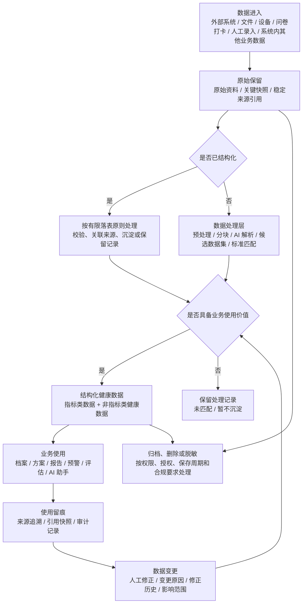

# 健康数据中心产品方案

## 1. 文档定位

本文从产品视角定义“健康数据中心”的建设目标、业务边界、产品原则、能力范围和后续待决策问题。

本文面向研发、产品、实施和业务协作伙伴，用于帮助各方理解健康数据中心为什么建设、管理什么数据、提供什么能力、与业务模块如何协作。

本文不是技术实现方案，不限定具体数据库模型、服务拆分、接口形式、任务调度方式或系统架构。相关实现方案由研发结合整体架构另行设计。

当前阶段暂不按一期、二期拆分，也不优先讨论页面展示形态，而是先明确健康数据中心作为系统级数据底座应具备的产品能力。

## 2. 一句话定义

健康数据中心是一套面向健康管理业务的数据底座能力，用于统一接收、保存、加工、标准化和服务患者相关健康数据，并支撑后续查询、追溯、修正、引用、审计和 AI 使用。

它不是一个单独页面，也不是某个业务模块的附属功能，而是患者档案、健康方案、问卷量表、预警监测、报告生成、阶段评估、AI 助手等业务共同依赖的数据基础设施。

凡是系统内需要读取、写入、分析或引用健康数据的场景，原则上都应通过健康数据中心形成统一数据口径。

## 3. 为什么要建设健康数据中心

健康管理业务不是一次性查看数据，而是在建档、评估、制定方案、随访、报告生成、阶段复盘和 AI 辅助等多个环节反复使用同一批健康数据。

如果各业务模块分别维护健康数据，容易出现以下问题：

- 同一患者的数据分散在多个模块中，无法形成统一健康视图。
- 同一指标或健康事实在不同模块中口径不一致。
- 报告、方案、预警、评估等业务重复加工同一批数据。
- 数据来源不清，后续难以复核、修正和追溯。
- AI 使用数据时缺少稳定上下文和可追溯依据。
- 后续新增指标、新增数据源或新增业务场景时扩展成本高。

健康数据中心要解决的核心问题，是把多来源、异构、非标准、非结构化或半结构化的健康数据，沉淀为可查询、可追溯、可治理、可被业务复用的数据资产。

目标态下，健康数据中心应形成一条从数据进入、原始保留、加工沉淀、业务使用到追溯审计的稳定产品链路。

## 4. 产品建设原则

- 原始资料优先保留：健康数据不能只保存加工后的结果，应保留原始资料或稳定来源引用，支撑复核、追溯、重加工和审计。
- 结构化数据有限沉淀：健康数据中心不追求全量结构化，只沉淀会被业务使用、需要长期追踪、需要复用或需要审计的数据。
- 健康数据中心不替业务模块做最终判断：健康数据中心提供数据、来源、质量状态、修正记录和引用能力；具体业务判断由业务模块按场景规则决定。
- AI 结果必须有依据：AI 可以参与识别、提取、总结和生成，但关键健康数据应能够回到原始来源、系统内来源记录或人工修正记录。
- 多来源数据并存，不简单覆盖：同一健康指标或健康事实允许多来源数据共存（如院内系统、上传报告、设备测量分别记录的空腹血糖），健康数据中心保留所有来源数据及其来源信息，不替业务做优先级判断或覆盖。具体业务场景采用哪条数据，由业务模块按场景规则选择。

## 5. 健康数据流转与生命周期

本章用一张图说明健康数据从进入系统到被业务使用、修正、重加工、归档或删除的完整产品链路，不限定具体技术实现方式。



这张图需要表达四个产品判断：

- 原始资料和来源引用是后续追溯、复核、重加工的基础。
- 已结构化数据不进入 AI 解析链路，可直接按有限落表原则处理。
- 只有具备业务使用价值的数据，才进入结构化健康数据范围。
- 健康数据被业务使用后，必须能够记录引用、支持修正，并按权限和合规要求处理归档、删除或脱敏。

### 5.1 概念数据模型

在展开各项产品能力之前，先梳理健康数据中心涉及的核心数据实体及其关系，帮助研发理解产品层面的实体边界和关联方式。此模型不替代技术数据建模。

核心实体：

| 实体 | 说明 | 生命周期 |
|------|------|---------|
| 患者（所属人） | 健康数据的所有者，由患者身份识别统一标识 | 长期存在 |
| 原始数据 | 进入系统的原始文件、接口 payload、设备数据或来源记录，保持原貌 | 按保存周期管理 |
| 候选数据集 | AI 解析原始数据后生成的结构化中间产物，记录识别结果和依据 | 独立于原始数据保存，可在规则升级后重加工 |
| 标准数据项 | 标准数据体系中唯一定义的健康数据单元（指标类或非指标类） | 长期维护，支持启停 |
| 结构化健康数据 | 已标准化、通过落表判断、可长期复用的正式健康数据 | 长期追踪，支持修正 |
| 修正记录 | 对结构化健康数据的人工修改历史 | 追加写，不覆盖 |
| 业务引用记录 | 业务模块使用健康数据时的留痕，含引用快照 | 追加写 |

实体关系（简化）：

```
患者(人) ──1:N── 原始数据(文件/payload/来源记录)
原始数据 ──1:N── 候选数据集(AI 解析结果)
候选数据 ──N:1── 标准数据项(经标准匹配后)
候选数据 ──1:1── 结构化健康数据(通过落表判断后)
结构化健康数据 ──1:N── 修正记录
结构化健康数据 ──1:N── 业务引用记录
标准数据项 ──N:M── 健康管理主题
```

关键关系说明：

- 同一份原始数据（如一份体检 PDF）可以产生多次候选数据集（规则升级后重加工），因此是 1:N 关系。
- 候选数据集中的每个候选项，通过标准匹配关联到零个或一个标准数据项。未匹配的候选项不落表但仍保留在候选数据集中。
- 候选数据通过落表判断后，生成对应的结构化健康数据记录。每条结构化健康数据追溯回到候选数据，进而回到原始数据。
- 修正记录和业务引用记录均以追加方式写入，不直接修改结构化健康数据的当前值记录，以保证历史可追溯。

## 6. 产品能力设计

本章是本文的核心章节，用于定义健康数据中心需要建设的产品能力。这里的”能力”不等同于具体系统模块，研发可根据整体架构选择实现方式。

### 6.0 能力分层架构

在展开各项能力之前，先将 10 项产品能力归入 6 个逻辑层，建立”能力在架构上如何分层协作”的整体认知。此图与第 5 章的数据流转图互补：第 5 章回答”数据怎么流转”，本章回答”能力怎么分层”。

```
┌─────────────────────────────────────────────────────────┐
│                      治理与安全层                         │
│  · 6.8 规则配置与治理能力                                  │
│  · 6.9 溯源、修正、引用与审计能力                           │
│  · 6.10 权限、授权与数据边界能力                            │
│                                                         │
│  本层贯穿以下各层，为每一层提供规则、追溯和安全保障。            │
├─────────────────────────────────────────────────────────┤
│                      数据服务层                           │
│  · 6.7 数据服务能力                                      │
│                                                         │
│  统一对外供给原始数据、候选数据、结构化数据、溯源信息和 AI 上下文。 │
├─────────────────────────────────────────────────────────┤
│                      数据资产层                           │
│  · 6.5 标准数据体系能力                                   │
│  · 6.6 结构化健康数据能力                                  │
│                                                         │
│  定义”什么样的数据是可复用资产”，并管理已沉淀的结构化健康数据。    │
├─────────────────────────────────────────────────────────┤
│                      数据处理层                           │
│  · 6.4 数据处理层能力                                     │
│                                                         │
│  承接需要 AI 解析的非结构化数据，生成候选数据集并完成标准匹配。     │
├─────────────────────────────────────────────────────────┤
│                      数据存储层                           │
│  · 6.3 原始数据管理能力                                   │
│                                                         │
│  统一管理进入系统的原始数据，保留来源依据，保持原貌不修改。          │
├─────────────────────────────────────────────────────────┤
│                      数据接入层                           │
│  · 患者身份识别                                          │
│  · 6.2 数据接入能力                                      │
│                                                         │
│  多来源健康数据的统一入口，负责接收、记录来源、管理接入状态。          │
└─────────────────────────────────────────────────────────┘
```

层级间的关系：

- **自下而上**：数据从接入层逐层向上流转——原始保留 → 处理识别 → 标准沉淀 → 统一供给。
- **治理贯穿**：治理与安全层不独立于其他层存在，而是为接入、存储、处理、资产、服务每一层提供规则、质量、追溯、权限和审计能力。
- **各层解耦**：上层不直接修改下层数据。原始数据一旦保存，不被处理层修改；AI 解析结果独立保存，不写入原始数据记录。

### 6.1 能力总览

| 能力            | 解决的问题            | 核心要求                           |
| ------------- | ---------------- | ------------------------------ |
| 数据接入能力        | 多来源健康数据如何进入系统    | 来源清楚、状态可跟踪、失败可处理               |
| 原始数据管理能力      | 原始数据和来源依据如何保留和回看 | 保留原始文件、原始 payload、关键快照或稳定来源引用  |
| 数据处理层能力       | 非结构化资料如何转为可用健康数据 | 支持预处理、AI 解析、候选保存、标准匹配、质量判断和重加工 |
| 标准数据体系能力      | 健康数据口径如何统一       | 覆盖指标类和非指标类数据，支持名称、分类、主题和启停管理   |
| 结构化健康数据能力     | 哪些数据沉淀为可复用资产     | 支持指标和非指标数据沉淀、多来源并存、历史追踪和修正留痕    |
| 数据服务能力        | 健康数据如何统一对外供给     | 统一供给原始数据、候选数据、结构化数据、溯源信息和 AI 上下文 |
| 规则配置与治理能力     | 规则和问题如何持续维护      | 支持规则维护、处理结果查看、问题追踪和配置启停        |
| 溯源、修正、引用与审计能力 | 数据使用后如何可解释、可复核   | 支持来源追溯、修正留痕、引用快照和关键操作审计        |
| 权限、授权与数据边界能力  | 健康数据如何被安全使用      | 支持租户隔离、授权访问、权限分级、归档删除和脱敏       |

### 6.2 数据接入能力

能力目标：定义哪些健康数据可以进入健康数据中心，以及这些数据通过什么方式进入、如何记录来源、如何跟踪接入过程。

边界说明：数据接入层负责“接收数据、记录来源、管理状态”，不负责 AI 解析、标准化、落表判断和业务取数。结构化数据进入有限落表链路，非结构化和外部原始数据进入后续数据处理层。

接入原则：

- 只接入健康管理业务会复用、追踪、分析、引用或审计的数据，不接入无健康数据价值的过程信息。
- 外部来源优先接入完整原始资料或原始数据，不只接入少量加工后字段。
- 系统内产生的结构化数据可直接接入，并按有限落表原则处理。
- 每次接入都应明确所属人、来源渠道、来源时间、接入方式和处理状态。
- 接入结果应可查询、可排查、可重试、可追溯。

不接入范围：

- 只服务单次页面展示、没有后续复用价值的数据。
- 纯业务过程状态，且不构成健康事实的数据。
- 临时计算结果，且不需要后续追溯、复核或审计的数据。
- 与健康管理无关的运营、营销、流程或权限数据。

接入对象分类：

| 来源渠道      | 数据种类名称                 | 常见格式类型                     | 接入重点                            |
| --------- | ---------------------- | -------------------------- | ------------------------------- |
| 外部系统      | 病历、检验、检查、处方、诊疗记录、体检数据  | XML、JSON、接口 payload、PDF、图片 | 通过统一接口获取院内原始数据，保留来源系统、原始字段和接入时间 |
| 患者或工作人员上传 | 体检报告、既往病历、检查检验报告、健康资料  | PDF、图片、Word、Excel、扫描件      | 保留原始文件、上传人、上传时间、资料类型和所属人        |
| 系统内采集     | 问卷、量表、打卡、自测、生活方式、人工录入  | 结构化表单、字段数据、文本备注            | 结构化字段可直接接入，文本备注可作为后续处理对象        |
| 物联设备与厂商同步 | 血压、血糖、体重、体脂、运动、睡眠等测量数据 | 接口数据、设备事件、厂商 JSON          | 记录设备、采集时间、单位、频率和厂商来源            |
| 系统内其他业务数据 | 人工标记标签、风险标签、备注、人工补录等   | 结构化字段、标记记录、备注文本            | 明确数据来源、操作人、产生时间和业务场景            |

提示：不是所有接入数据都需要经过 AI 解析处理。结构化数据与非结构化数据的处理差异，见“6.4 数据处理层能力”。

接入方式：

- 统一接口获取：适用于院内系统、互联网医院等外部系统，优先获取完整原始数据，例如原始 XML、JSON、接口 payload、报告文件等。
- 接口同步：适用于物联设备、第三方平台等持续产生的数据。
- 文件上传：适用于报告、病历、图片、扫描件、Excel、Word 等资料归档。
- 批量导入：适用于历史数据迁移、批量体检数据、批量设备数据。
- 系统内写入：适用于问卷、打卡、自测、人工录入、人工标记标签等系统内其他业务数据。
- 手工补充：适用于接入失败、资料缺失、来源不完整等需要人工补录的场景。

外部系统对接说明：

- 业务侧需要先与客户对齐实际需求，明确需要哪些数据字段，以及这些字段来自哪些院内文档材料，以确定系统需要解析获得哪些数据，以及从哪个文档解析获得。
- 当前外部系统对接主要是字段级对接，按目标字段逐项取数。本次重构调整为通过 API 获取完整的院内原始文件或原始数据，由健康数据中心自行解析、识别、标准化，并按字段完成有限落表。
- 如果客户只能提供字段级数据，也应同步记录字段来源、来源系统、口径说明和对应原始文档关系，避免后续无法追溯。

患者身份识别：

多来源健康数据进入系统后，需要通过患者身份识别将数据关联到正确的所属人。身份识别采用多要素递进确认模型：

- 第一层（确定性匹配）：身份证号精确匹配，置信度最高，通过后直接关联。
- 第二层（高概率匹配）：姓名 + 性别 + 出生日期三元组加权相似度匹配，达到阈值自动关联。
- 第三层（扩展匹配）：手机号、地址、院内就诊卡号等扩展字段辅助判定，落入置信度区间时触发人工复核。
- 未匹配数据：作为候选记录保存，等待后续数据补充后重新评估或人工处理。
- 错误合并应可拆分（回滚），每次合并操作需记录审计日志。

接入管理能力：

接入层需要提供可监控、可管理的接入管理能力，通过状态管理跟踪每次数据接入的处理进度和结果。

建议至少支持以下状态：

- 已接收：数据已进入健康数据中心。
- 处理中：数据正在保存、校验或进入后续处理链路。
- 已完成：数据已完成接入，并进入原始资料管理或有限落表流程。
- 部分完成：部分数据接入成功，部分数据失败或缺失。
- 待补充：缺少所属人、来源、时间、文件内容等必要信息。
- 处理失败：数据无法保存、格式无法识别或接入过程异常。

接入管理应支持按来源、人员、时间、接入方式和状态进行查询，用于问题排查、失败重试和人工补充。

接入状态流转规则：

```text
已接收 ──→ 处理中 ──→ 已完成
  │          │
  │          ├──→ 部分完成 ──→ 处理中(补传/补充后重试)
  │          │
  │          ├──→ 处理失败 ──→ 处理中(重试)
  │          │                  └── 人工补录 → 处理中
  │          │
  │          └──→ 待补充 ──→ 处理中(补充后重试)
  │                    └──→ 废弃(超时未补充)
  │
  ├──→ 待补充(直接跳转，无需经过处理中)
  │
  └──→ 处理失败(直接跳转，格式无法识别或接入异常)
```

状态流转说明：

- 已接收 → 处理中：数据格式校验通过，进入保存或处理链路。
- 已接收 → 待补充：缺少所属人、来源、时间等必要信息（直接跳转，无需经过处理中）。
- 已接收 → 处理失败：格式无法识别或接入过程异常（直接跳转）。
- 处理中 → 已完成：全部数据接入成功。
- 处理中 → 部分完成：部分数据接入成功，部分失败或缺失。
- 处理中 → 处理失败：处理过程异常或超时。
- 处理中 → 待补充：处理过程中发现必要信息缺失。
- 部分完成 / 处理失败 / 待补充 → 处理中：补传文件、补充信息或触发重试后重新进入处理链路。
- 待补充 → 废弃：超时未补充必要信息，接入任务关闭。

### 6.3 原始数据管理能力

能力目标：统一管理进入健康数据中心的原始数据，保留数据来源依据，支撑回看、复核、追溯、审计和后续重加工。

边界说明：原始数据管理层负责保存来源依据和关联关系，不负责 AI 解析、标准化和落表判断。

管理对象：

- 原始文件：PDF、图片、Word、Excel、扫描件、报告附件等。
- 原始接口数据：院内系统返回的 XML、JSON、接口 payload、字段级数据等。
- 原始设备数据：设备事件、厂商原始数据、批量同步数据等。
- 系统内来源记录：问卷、量表、打卡、自测、人工录入、人工标记标签等。
- 原始数据的基础信息：所属人、来源渠道、来源系统、来源时间、接入方式、接入批次、资料类型。

保存原则：

- 外部来源数据应尽量完整保存原始文件或原始 payload，避免只保留加工后的字段。
- 系统内业务数据不一定完整复制，可保存稳定来源引用；关键业务依据可保存快照。
- 原始数据一旦保存，不应被数据处理层直接修改；后续解析、标准化、修正都应另行记录。
- 原始数据需要支持按人员、来源、时间、资料类型、接入批次进行查询和回看。
- 原始数据需要与候选数据集、结构化健康数据、业务引用记录建立关联。

存储建议：

原始数据管理建议采用“统一索引 + 分类型存储”的方式。

- 统一索引：用于管理所属人、来源渠道、来源系统、资料类型、接入方式、接入批次、接入时间、处理状态和关联关系。
- 文件类原始内容：如 PDF、图片、Word、Excel、扫描件，保存文件地址、文件元信息和来源信息。
- 接口 payload 类原始内容：如 XML、JSON、接口返回内容，保存原始 payload 或原始内容存储位置。
- 设备原始数据：根据数据频率和业务需要，按事件、批次或汇总记录保存。
- 系统内来源记录：如问卷、打卡、自测、人工录入、人工标记标签，优先保存稳定来源引用，必要时保存关键快照。

原始内容不要求全部存放在同一张表中，但必须能通过统一索引被检索、回看和追溯。

AI 解析结果保存方式：

AI 解析后得到的是“候选数据集”或“处理结果”，不建议直接作为原始记录的一个字段附在原始数据上。

推荐方式：

- 原始数据独立保存，保持原貌。
- AI 解析结果独立保存，作为原始数据的处理结果。
- AI 解析结果通过原始数据 ID、页码、区域、字段路径、原文片段等信息关联回原始数据。
- 同一份原始数据可以产生多次解析结果，用于支持规则升级、模型升级和历史重加工。

原因：

- 原始数据需要保持稳定，不能随解析结果变化而变化。
- AI 解析结果可能多次生成、被修正或被废弃，不适合直接覆盖在原始记录上。
- 后续新增指标或调整规则时，需要基于同一份原始数据重新生成新的候选数据集。
- 独立保存处理结果，更利于追溯、对比、回滚和质量排查。

### 6.4 数据处理层能力

能力目标：承接需要 AI 解析的原始数据，将非结构化资料和外部原始数据处理为候选数据集，并为后续标准匹配和有限落表提供依据。

边界说明：数据处理层不处理已映射结构化数据，不修改原始数据，也不保存原始文件本身。已映射结构化数据由接入层分流后直接进入有限落表链路。

处理对象：

- 非结构化资料：PDF、图片、扫描件、Word、Excel、报告文本、病历文本、自由文本等。
- 外部原始数据：XML、JSON、接口 payload 等。虽然形式上可能是结构化格式，但字段含义、口径和映射关系通常不稳定，仍需要解析和标准匹配。
- 复杂文本内容：备注、结论、病史描述、异常说明、建议文本等。

处理管线：

非结构化和外部原始数据通过以下六个阶段完成从原始输入到结构化输出的处理：

1. **格式预处理**：文档格式归一化（PDF 转标准页、图片增强、非标准编码转换），必要时在预处理阶段完成患者隐私信息的脱敏处理。
2. **文档分类**：识别报告类型（检验报告 / 检查报告 / 出院小结 / 处方 / 体检报告等），确定该类型对应的抽取 schema 和预期字段集合。
3. **版面分析**：检测文本块、表格区域、图片区域及阅读顺序，识别跨页表格的延续关系。
4. **内容抽取**：OCR 文本识别或结构化字段提取。数字原生 PDF 可走直接文本提取路径，扫描件 / 拍照件走 OCR 路径。
5. **实体识别与标准化**：医学实体抽取（检验项目名、结果值、单位、参考范围、结论、诊断、用药等），结合 6.5 标准数据体系进行名称标准化和同义词映射。
6. **结构化输出与置信度评估**：按预先定义的 schema 输出结构化 JSON（即候选数据集），逐字段标注置信度分数和来源依据（页码、区域、原文片段）。

整体产出是候选数据集，进入后续标准匹配和有限落表判断。

不进入本层的数据：

- 系统内结构化表单，例如结构化问卷、打卡、自测、人工录入。
- 已完成字段映射且含义明确的物联设备数据。
- 已经由业务系统明确写入的标签、风险标记、备注等系统内其他业务数据。

这些数据不需要经过 AI 解析，可直接按有限落表原则进入结构化健康数据链路。

候选数据集：

AI 对原始数据解析后，通常输出一份结构化 JSON，本文称为“候选数据集”。候选数据集是处理层生成的中间产物，用于记录“AI 识别到了什么、依据是什么、可能对应哪个标准项、当前处理状态是什么”。

候选数据集不是正式健康数据，也不是最终落表数据。它至少应包含：

- 原始识别结果：原始名称、原始值、原始单位、原始文本。
- 候选类型：指标、病史、用药、过敏、生活方式、结论、异常项等。
- 来源依据：原始数据 ID、页码、区域、行列、字段路径或原文片段。
- 处理信息：模型版本、规则版本、处理时间、处理状态。
- 标准化候选：可能匹配的标准指标或标准数据项。

示例格式：

```json
{
  "source_type": "report_file",
  "source_id": "report_001",
  "parse_status": "success",
  "items": [
    {
      "item_type": "metric_candidate",
      "raw_name": "空腹血糖",
      "raw_value": "6.8",
      "raw_unit": "mmol/L",
      "recorded_at": "2026-04-20",
      "evidence": {
        "page": 2,
        "text": "空腹血糖 6.8 mmol/L"
      },
      "standard_candidate": {
        "metric_name": "空腹血糖",
        "metric_code": "FPG"
      },
      "process_status": "pending_match"
    }
  ]
}
```

保存方式：

- 中小型解析结果：可保存为数据库 JSON 字段。
- 大文件或大量解析结果：可保存为 JSON 文件或对象存储内容，数据库保存引用地址和摘要。
- 需要频繁查询、筛选或重加工的候选项：可进一步拆成候选结果记录。

候选数据集应独立于原始数据保存，并通过原始数据 ID、页码、区域、原文片段等信息关联回原始数据。

置信度路由规则：

AI 解析结果按逐字段置信度分为三档处理：

- 高置信度（>95%）：自动进入标准匹配和落表判断，无需人工介入。
- 中置信度（80-95%）：进入标准匹配流程，但标记为待复核。重要指标可要求人工确认后落表。
- 低置信度（<80%）：保留在候选数据集中，不进入结构化落表，进入人工处理队列。

置信度阈值可在治理端按数据项调整。关键安全指标（如用药剂量、危急值）可强制要求人工确认，不受自动阈值控制。

候选项落表判断：

不是所有候选项都落表。候选项是否落表，应由“标准体系 + 业务规则 + 质量判断”共同决定。

- 标准项已定义：能匹配到标准指标或标准健康数据项。
- 业务会使用：会被档案、方案、报告、预警、评估或 AI 调用。
- 需要长期追踪：需要形成趋势、阶段对比或持续管理。
- 来源可追溯：能回到原始数据、来源记录或系统内来源记录。
- 质量可接受：值、单位、时间、人员归属等关键要素完整。
- 当前已启用：该指标或数据项在当前业务范围内允许沉淀。

不满足落表条件的数据，应保留候选数据集、失败原因或未匹配状态，避免后续无法重加工。

标准匹配与标准化：

系统判断“应该标准化成什么名称”，不能只靠 AI 猜测，应优先依赖标准数据体系和规则配置。

建议匹配顺序：

```text
来源映射规则
-> 标准名称/编码精确匹配
-> 别名、缩写、同义词匹配
-> 结合单位、值类型、业务主题辅助匹配
-> AI 辅助判断
-> 未匹配则保留候选结果
```

标准化需要处理：

- 名称标准化：中文名、英文名、缩写、别名、厂商字段名统一到标准项。
- 单位处理：当前阶段先保留原始单位，不做统一单位换算；单位标准化和换算规则后续再确认。
- 值类型标准化：区分数值、范围、阴阳性、文本结论、枚举值。
- 时间标准化：区分检测时间、报告时间、上传时间、记录时间。
- 来源标准化：区分外部系统、报告文件、设备、问卷、人工录入、系统内其他业务数据。
- 质量状态标准化：标记正常、异常、未匹配、处理失败等状态。

实现注意：

- 已映射结构化数据由接入层分流后进入有限落表链路，不进入本层 AI 解析。
- 非结构化和外部原始数据通过 AI 解析生成候选数据集。
- 高确定性规则自动处理，低确定性结果保留为未匹配或异常处理记录。
- 同一指标多来源并存，不在处理层简单覆盖。
- 处理过程应记录模型版本、规则版本、处理批次和处理结果。

后续升级：人工确认可作为后续增强能力，用于处理低确定性匹配、重要数据复核和规则沉淀，当前阶段不作为必需流程。

当前阶段 AI 处理能力边界（参考，随模型升级更新）：

以下边界基于当前业内可达到的典型水平列出，用于设定合理的产品预期。具体实现精度取决于模型选择、训练数据质量和持续优化投入。

| 数据场景 | 当前可达水平 | 典型失败模式 | 建议策略 |
|---------|------------|------------|---------|
| 数字 PDF 检验报告提取 | 95-98% F1 | 罕见格式变异、非标表格布局 | Schema-guided 抽取，高置信度自动通过 |
| 复杂表格报告（扫描件/拍照件） | 70-76% 结构还原 | 合并单元格、跨页表格、扫描噪声 | 保留原文依据，中置信度+人工复核 |
| 手写内容识别 | 85-92%（专用模型）vs 54%（通用OCR） | 潦草字迹、竖排书写、中医处方习惯 | 优先采集电子数据，手写标记需复核 |
| 跨机构名称标准化 | 98%+（领域微调模型） | 罕见别名、本地化缩写、检验套餐拆分粒度差异 | 自动标准化+未匹配时人工补充别名 |
| 纯文本临床记录抽取 | 89-93% NER F1 | 嵌套实体、边界模糊、隐式术语（未显式写出但上下文可推断） | 保留原文上下文，AI 结果标注来源依据 |
| 混合中英文术语识别 | 98.9%（专用字符级模型） | 罕见药物品牌名、设备名缩写 | 结合标准数据体系的同义词库兜底 |

关键提示：

- 领域微调的中文医疗模型在中文医疗文档上的表现显著优于通用大模型，选型时应优先考虑。
- 上述边界是"当前阶段"的快照，随模型升级和训练数据积累而变化，不作为固定约束。
- 六阶段管线中每个阶段的失败都会传导到下游，因此管线设计的重点不是追求单阶段的极致准确率，而是确保每阶段的失败模式可被下游检测、补偿或路由到人工处理。

### 6.5 标准数据体系能力

能力目标：建立统一健康数据口径，形成 AI 可依循的标准化知识库，使不同来源、不同名称、不同格式的健康数据能够被识别、归一、追踪和复用。

边界说明：本能力定义"数据应标准化成什么样"，不负责 AI 解析过程（6.4）、结构化落表（6.6）和数据对外服务（6.7）。标准数据项可独立管理、追踪、溯源和调用；具体存储和实现方式由研发评估。

#### 6.5.1 标准数据分类体系

标准数据项分为两大类、七子类：

**一、指标类数据**（可量化的测量/检验结果）

| 子类 | 范围 | 典型数据项 |
|------|------|-----------|
| 1.1 体格测量 | 生命体征和身体测量 | 收缩压、舒张压、心率、身高、体重、BMI、腰围 |
| 1.2 实验室检验 | 血液、尿液等标本的实验室检测 | 空腹血糖、糖化血红蛋白、总胆固醇、甘油三酯、HDL-C、LDL-C、尿酸、肌酐、ALT、AST |
| 1.3 设备测量 | 家用或可穿戴设备采集数据 | 血糖仪读数、血压计读数、体脂秤数据、运动手环步数/心率 |

**二、非指标类数据**（健康状态/事实的定性记录）

| 子类 | 范围 | 典型数据项 |
|------|------|-----------|
| 2.1 疾病史与诊断 | 既往病史、现病史、家族史 | 高血压病史、糖尿病病史、冠心病病史、肿瘤史、传染病史（参考 ICD-11 分类） |
| 2.2 用药记录 | 当前用药、用药史、过敏药物 | 药品名称、剂量、用法、起止时间（参考医保药品编码 YB） |
| 2.3 手术与操作史 | 手术史、操作记录 | 手术名称、手术日期、操作记录（参考 ICD-9-CM3） |
| 2.4 生活方式与健康标签 | 生活习惯、风险标签、问卷结果 | 吸烟状况、饮酒频率、运动频率、饮食结构、睡眠质量、风险标签、问卷量表结果 |

#### 6.5.2 标准数据项属性模型

每个标准数据项至少包含以下属性：

| 属性 | 说明 | 示例（空腹血糖） |
|------|------|-----------------|
| 标准名称 | 系统内唯一的标准中文名称 | 空腹血糖 |
| 标准编码 | 系统内标准编码，可参考 WS/T 363 DE 标识符 | DE04.50.001.00 |
| 别名/同义词列表 | 可被匹配的替代名称和缩写 | [FPG, 葡萄糖(空腹), GLU, 空腹血糖测定] |
| 数据分类 | 所属类别（1.1-2.4 分类体系） | 1.2 实验室检验 |
| 数据类型 | 数值型 / 枚举型 / 文本型 / 范围型 | 数值型 |
| 标准单位 | 系统内存储的参考单位（当前阶段不做强制换算） | mmol/L |
| 值域约束 | 正常参考范围或允许取值 | 3.9-6.1 mmol/L |
| 关联健康主题 | 属于哪些健康管理主题（可多选） | [代谢管理, 糖尿病管理, 心血管管理] |
| 启用状态 | 是否在当前业务范围内启用 | 已启用 |
| 来源映射规则 | 已知来源系统的字段名映射（可选） | HIS_X: GLU_F; 报告模板A: 空腹血糖测定 |

#### 6.5.3 行业标准对标

标准数据体系的建设不独立另起炉灶，而是以国家卫健委已颁布的标准体系为基础进行筛选和补充。下表列出标准数据体系与已有行业标准的对标关系：

| 健康数据类别 | 对标标准 | 覆盖内容 | 引用方式 |
|------------|---------|---------|---------|
| 体格测量（血压、BMI 等） | WS/T 363.7、WS 365 | 数据元名称、数据类型、单位、值域 | 直接引用数据元定义 |
| 实验室检验（血糖、血脂、尿酸等） | WS/T 363.9、WS 446（LOINC） | 检验项目名称、编码、标本类型 | WS 446 编码 + LOINC 映射 |
| 疾病诊断 | ICD-11 中文版 | 疾病分类、编码、层级关系 | 直接引用编码和层级 |
| 用药记录 | 医保药品编码（YB） | 药品名称、ATC 分类、剂型、规格 | 直接引用编码和分类 |
| 手术操作 | ICD-9-CM3（医保版） | 手术分类、编码、层级 | 直接引用编码和层级 |
| 问卷量表 | WS 365、WS/T 483 | 慢性病随访数据集 | 部分引用 + 自有扩展 |
| 医学术语补充 | OMAHA 七巧板术语集 | 105 万+概念、140 万+术语 | 作为同义词库和未匹配 fallback |

提示：具体标准编号、名称和详细对标关系见附录 A"行业标准对标清单"。

#### 6.5.4 AI 标准化的知识库输入

标准数据体系同时作为 AI 标准化处理的知识库基底：

- AI 在标准匹配阶段（见 6.4），优先查询标准数据项的名称、别名、编码和来源映射规则进行匹配。
- 高频未匹配项（同一原始名称反复出现但无法匹配到任何标准数据项）应自动提示是否需要新增标准数据项，支持标准体系的持续扩展。
- 标准数据体系变更（新增标准项、停用旧标准项、更名）后，支持对历史候选数据集触发重加工，基于新规则重新匹配。

#### 6.5.5 标准体系的建设方式

建设原则：

- 按业务需求有限建设，不追求一次性覆盖所有健康数据项。
- 优先建设会被档案、方案、报告、预警、评估、AI 调用的数据项。
- 第一批建议覆盖：血压、血糖、血脂、尿酸、体重形态（指标类），以及病史、用药、过敏、生活方式、标签（非指标类）。
- 标准数据项、别名、分类和来源映射前期以人工维护为主。
- 后续可基于候选数据集中未匹配的高频项，自动推荐新增标准数据项，逐步降低人工维护成本。
- 标准数据体系随业务场景、数据来源和管理主题的扩展持续增量建设。

### 6.6 结构化健康数据能力

能力目标：沉淀已完成标准化、且具备业务使用价值的结构化健康数据，形成可长期追踪和复用的数据资产。

边界说明：本能力只回答”哪些数据可以作为结构化健康数据被长期保存和管理”。对外查询、写入、溯源和场景化供数由数据服务能力（6.7）承载；具体业务场景采用哪条数据，由业务模块按场景规则决定。

与其他能力的关系：
- 上游依赖：标准数据体系（6.5）提供标准化依据；数据处理层（6.4）提供候选数据集和落表判断结果。
- 下游供给：数据服务能力（6.7）通过本层获取结构化数据对外供给；溯源修正（6.9）以本层数据为基础记录修正和引用。

关键要求：

- 支持指标类数据沉淀，例如血压、血糖、血脂、尿酸、体重形态等。
- 支持非指标类健康数据沉淀，例如病史、用药、过敏、生活方式、标签、问卷结果、设备结果等。
- 同一数据项允许多来源并存，保留来源、时间、质量状态和处理状态。
- 支持历史记录保留，支撑趋势、阶段对比和长期健康管理。
- 支持人工修正、修正原因和修正历史记录。
- 保留业务取数所需的基础信息，例如最新值、指定来源值、指定时间范围值和业务场景指定值。

### 6.7 数据服务能力

能力目标：面向业务模块、AI 能力和管理端，统一提供健康数据中心内所有健康数据的对外供给能力。

服务对象：

- 患者档案、健康方案、报告、预警、阶段评估等业务模块。
- AI 助手、AI 报告生成、AI 风险分析等智能能力。
- 运营管理端、数据治理端和问题排查场景。

供给范围：

- 原始数据：原始文件、原始接口数据、上传资料、来源记录。
- 候选数据：AI 解析结果、未匹配结果、处理失败结果、待重加工结果。
- 结构化数据：已标准化、已沉淀、可长期复用的健康数据。
- 过程信息：接入状态、处理状态、质量状态、规则版本、修正记录。
- 溯源信息：来源系统、原始资料位置、证据片段、业务引用记录。
- AI 上下文：用于 AI 分析、解释和生成内容的数据包及来源依据。

关键要求：

- 支持按人、来源、时间、数据类型、业务场景查询健康数据。
- 支持按最新值、指定来源、指定时间范围、指定业务场景返回数据。
- 支持系统内业务场景写入健康数据，例如问卷、打卡、自测、人工录入、人工标记标签等。
- 支持业务查看数据来源、质量状态、修正记录和引用记录。
- 支持 AI 获取结构化数据、原始证据和必要上下文，避免只给结论不给依据。
- 支持按业务场景组织返回结果，降低各业务模块重复拼装数据的成本。

边界说明：数据服务能力负责“供给数据和依据”，不负责页面展示、预警规则、报告生成、健康方案制定和最终业务结论。

### 6.8 规则配置与治理能力

能力目标：支撑健康数据中心的标准、规则、配置和质量问题持续维护，确保规则可维护、问题可追踪、结果可解释。

边界说明：治理能力的重点是”规则可维护、问题可追踪、结果可解释”，不要求一次性建设完整治理工作台。本能力覆盖标准体系治理、处理规则治理和质量问题治理三个方向。

与其他能力的关系：本能力贯穿数据处理层（6.4）、标准数据体系（6.5）和结构化健康数据（6.6），为这些能力提供规则配置、结果查看和问题追踪支撑。

核心能力：

- 标准体系治理：支持标准数据项、别名、分类、来源映射和启停状态的配置管理。
- 处理规则治理：支持接入规则、解析规则、标准匹配规则和落表规则的配置、版本管理和生效范围控制。
- 处理结果查看：支持按来源、人员、时间、数据类型、状态查看接入、解析、标准匹配和落表的处理结果。
- 问题追踪：支持失败原因、异常结果、待处理结果和未匹配结果的查询和追踪。
- 前期可由研发维护规则，后续按需要开放可视化配置能力。

数据质量维度参考：

健康数据中心的数据质量从以下五个维度进行度量和监控：

| 质量维度 | 定义 | 判定方式 | 适用阶段 |
|---------|------|---------|---------|
| 完整性 | 关键字段（值、单位、时间、所属人）是否齐全 | 规则自动检测 | AI解析后、落表前 |
| 准确性 | 提取值与原始资料原文是否一致 | AI 置信度 + 抽样校验 | AI 解析后 |
| 一致性 | 同一指标多来源时口径是否对齐 | 标准匹配结果 | 标准化后 |
| 时效性 | 数据采集/报告时间是否在业务有效期内 | 时间戳比对 | 业务使用前 |
| 可追溯性 | 是否能回到原始资料位置 | 来源关联完整性检查 | 全链路 |

### 6.9 溯源、修正、引用与审计能力

能力目标：保证健康数据被使用后仍可解释、可复核、可追溯。

边界说明：本能力覆盖数据从"被使用"到"被追溯"的后链路。修正后的数据是否影响已生成报告、方案或评估，应由对应业务规则决定，健康数据中心不自动触发业务结果的联动变更。

与其他能力的关系：
- 上游依赖：原始数据管理（6.3）提供来源依据；结构化健康数据（6.6）提供需要修正和引用的数据对象。
- 下游供给：数据服务能力（6.7）在对外供数时同步输出溯源信息；权限审计（6.10）依赖本能力的审计日志。

核心能力：

溯源：
- 支持从结构化健康数据、候选数据和业务引用结果，通过来源关联链路回溯到原始资料、来源记录或系统内来源记录。
- 溯源路径为：结构化健康数据 → 候选数据集 → 原始数据（文件/payload/来源记录）。

修正：
- 支持人工修正结构化健康数据，并记录修改前值、修改后值、修改人、修改时间和修改原因。
- 修正记录以追加方式写入，不直接覆盖原值，保证修正历史可追溯。
- 人工修正是否必须填写原因、是否需要审核，由后续业务决策确认。

引用：
- 支持业务引用留痕：记录哪些报告、方案、预警、评估、AI 内容使用了哪些健康数据。
- 建议保留引用快照（引用时刻的数据副本），避免源数据后续变化后无法解释历史业务结果。
- 已引用数据发生变化后，是否需要提醒业务人员，由后续业务决策确认。

审计：
- 支持关键操作审计：查看原始资料、修改数据、导出数据、引用数据等操作应记录操作人、操作时间、操作内容和结果。
- 审计记录不可篡改，支持按人员、时间、操作类型查询。

### 6.10 权限、授权与数据边界能力

能力目标：确保健康数据在多租户、多角色、多业务场景下被合规访问和使用。

边界说明：权限和授权规则会直接影响数据模型、业务流程和审计要求，需要在后续决策中优先确认。本能力定义产品层面的权限边界和合规要求，具体技术实现由研发评估。

#### 6.10.1 数据归属模型（产品建议）

当前阶段建议采用"租户归属为主 + 患者授权共享为辅"的模型：

- 默认规则：健康数据属于采集/生成该数据的租户，各租户数据相互隔离。
- 患者权利：患者有权查看、导出其在各租户的个人健康数据，有权申请更正错误数据。
- 跨租户共享：同一患者在多个租户产生数据时，经患者明确授权后，可在指定租户间共享指定范围内的数据。共享通过授权令牌控制，全程审计可追溯。
- 全局身份：患者主索引全局唯一（跨租户），用于跨租户身份解析和授权判断；但数据按租户分区存储，未经授权不跨租户流通。
- 演进方向：此模型可后续向"患者归属 + 授权访问"方向演进，当前阶段以租户归属作为工程基线更可控。

#### 6.10.2 合规基线

健康数据属于《个人信息保护法》第 28 条定义的敏感个人信息，处理需满足以下要求：

- 处理目的特定且必要，需取得个人的单独同意。
- 进行个人信息保护影响评估（PIPIA）后方可处理。
- 原始资料（含患者身份信息）的查看权限应高于结构化数据的查看权限。
- 数据删除、归档、脱敏需符合保存周期和合规要求，支持按租户、按数据类型、按时间范围配置策略。
- 关键操作（查看原始资料、修改数据、导出数据、引用数据）应完整审计，记录操作人、操作时间、操作内容和结果。

#### 6.10.3 角色与权限分级

- 支持租户级管理员、机构管理员、医生、患者等不同角色的数据访问边界。
- 支持原始资料、结构化数据、候选数据、业务引用记录设置不同权限等级。
- 支持患者授权、撤回、查看、删除或申请更正等产品规则预留。
- 支持跨租户服务同一人员时的数据归属、共享和隔离规则。
- 支持按权限、授权、保存周期和合规要求进行归档、删除和脱敏。

## 7. 后续待决策问题

以下问题需要在下一轮产品和研发协作中继续确认。这些问题的决策存在先后依赖关系：建议优先确定数据归属和租户隔离原则（7.5），在此基础上确定数据范围与优先级（7.1）、溯源修正的锁定策略（7.4），最后确定异常数据处理流程（7.3）和业务使用方式（7.2）。

### 7.0 最高优先级决策

以下三项建议在下一轮会议优先确认，因为后续数据模型设计、权限模型设计和接口设计均依赖这些判断：

1. **数据归属模型**：是否采用"租户归属为主 + 患者授权共享为辅"？还是直接走向"患者归属"模型？
2. **患者主索引策略**：全局唯一患者 ID 由哪些字段构成？身份证号为锚定字段是否确认？身份匹配的自动/人工阈值如何设定？
3. **原始资料保存周期**：永久保存还是有期限？合规要求的最短保存周期是多少？（参考：HIPAA 基准为 6 年，国内要求需与法务确认）

### 7.1 数据范围与优先级

- 第一批必须纳入健康数据中心的数据范围是什么。
- 第一批标准数据项是否围绕血压、血糖、血脂、尿酸、体重形态，以及病史、用药、过敏、生活方式、标签等高频数据建设。
- 问卷、打卡、自测、人工录入数据中，哪些需要结构化沉淀，哪些只保留来源引用。
- 设备数据是否属于高频数据，业务是否需要原始明细和汇总结果同时保留。

### 7.2 业务使用方式

- 业务是否需要跨指标、跨来源、跨时间查询健康数据。
- 业务模块取数时，是否需要区分最新值、指定来源值和业务指定值。
- AI 使用健康数据时，是否必须展示来源依据。

### 7.3 处理状态与后续升级

- 异常或未匹配的数据如何提示给业务人员。
- 处理失败后由谁处理，是否需要重新提交或人工补录。
- 历史原始资料重新处理后，是否自动更新已有结构化健康数据。
- 后续是否需要引入人工确认流程，用于重要数据复核、低确定性匹配和规则沉淀。
- 单位标准化和单位换算规则是否需要建设，以及何时启用。

### 7.4 溯源、修正与引用

- 原始资料是否永久保存，是否存在保存周期。
- 报告引用数据后，是否需要锁定当时值。
- 数据被人工修正后，历史报告、方案或评估是否同步变化。
- 人工修正是否必须填写原因，是否需要审核。
- 已引用数据发生变化后，是否需要提醒业务人员。

### 7.5 权限与租户

- 平台级数据底座和租户数据隔离的最终产品原则是什么。
- 跨租户服务同一个人时，数据归属如何定义。
- 患者授权、机构授权和医生授权之间如何区分。
- 原始资料查看权限是否高于结构化数据查看权限。
- 数据删除、归档、脱敏的产品规则是什么。

## 8. 当前结论摘要

健康数据中心的建设重点不是先做某个页面，而是建立一套可持续扩展的数据底座能力。

这套能力需要解决五件事：

1. 多来源健康数据能够进入系统，并尽可能保留原始资料、原始数据或稳定来源引用。
2. 非结构化资料和外部原始数据能够被识别、提取、标准匹配，并按业务价值形成结构化健康数据。
3. 原始数据、候选数据和结构化健康数据能够被患者档案、健康方案、报告、预警、评估和 AI 统一调用。
4. 健康数据被使用时，能够追溯来源、记录引用、支持修正和审计。
5. 健康数据中心只定义统一数据能力和产品边界，不替研发限定具体实现方式，也不替业务模块做最终业务判断。

只有这些底座能力稳定后，健康方案、预警监测、报告生成、阶段评估、AI 助手和 C 端展示才能共享同一套稳定统一的健康数据口径。

---

## 附录 A：行业标准对标清单

健康数据中心的标准数据体系以国家卫健委已颁布的标准体系为基础。下表列出与健康数据中心直接相关的关键行业标准及其引用关系：

| 标准编号 | 标准名称 | 对健康数据中心的作用 | 引用方式 |
|---------|---------|-------------------|---------|
| WS/T 363-2023（17 部分） | 卫生健康信息数据元目录 | 定义健康数据元的名称、数据类型、表示格式、单位等核心属性 | 直接引用数据元定义，作为标准数据项属性模型的规范来源 |
| WS/T 364-2023（17 部分） | 卫生健康信息数据元值域代码 | 定义数据元的允许值域、参考范围和代码表 | 直接引用值域约束，作为数据有效性校验的规则来源 |
| WS 445-2014（17 部分 58 子集） | 电子病历基本数据集 | 提供 EMR 数据集结构参考，覆盖病历概要、门诊、住院、检验、检查、用药等 | 落表结构参考，按业务需求选取子集 |
| WS 365-2011 | 城乡居民健康档案基本数据集 | 提供健康档案数据元参考，含体检、慢病随访数据集 | 数据元选型参考，慢病管理指标对标 |
| WS 446-2014 | 居民健康档案医学检验项目常用代码 | 检验项目编码体系，每个编码映射到 LOINC 代码 | 直接引用 HRLB 编码和 LOINC 映射，用于实验室检验类指标的标准编码 |
| WS/T 500-2016（53 部分） | 电子病历共享文档规范 | 53 类医疗文档的 CDA R2 结构模板，含检验报告、检查报告、出院小结等 | 文档解析 schema 设计参考，外部数据抽取时的字段预期 |
| WS/T 483-2016（20 部分） | 健康档案共享文档规范 | 健康档案相关共享文档模板，含高血压/糖尿病随访、成人健康体检等 | 慢病管理数据结构和随访记录的参考 |
| ICD-11 中文版 | 国际疾病分类第 11 版（中文） | 疾病诊断的标准编码和层级分类体系 | 直接引用编码，用于诊断类非指标数据的标准编码 |
| ICD-9-CM3（医保版） | 手术操作分类代码 | 手术操作的标准编码和层级分类 | 直接引用编码，用于手术史/操作史的标准编码 |
| 医保药品编码（YB） | 国家医保药品分类与代码 | 药品名称、ATC 分类、剂型、规格的唯一编码 | 直接引用编码，用于用药记录的标准编码 |
| OMAHA 七巧板术语集 | 中文临床医学术语集 | 105 万+概念、140 万+术语、310 万+关系的本体，含 17 个顶层类 | 作为同义词库、别名匹配和标准匹配的低置信度 fallback |
| GB/T 40423-2021 | 健康信息学 健康体检基本内容与格式规范 | 健康体检数据结构参考 | 体检类数据项的定义和分类参考 |
| 《医疗卫生机构患者主索引标准统一技术指南》(2023) | 患者主索引技术规范 | 三级 EMPI 架构（系统级→机构级→跨域主索引） | 参考架构设计，指导患者身份识别的技术实现 |

提示：
- "直接引用"指健康数据中心的标准编码和分类体系直接采用该标准的编码和层级结构。
- "参考"指健康数据中心以该标准为基础进行扩展或裁剪，不完全等同。
- WS 363/364 系列的完整标准文本可通过中国卫生健康信息标准管理平台（chiss.org.cn）获取。

---

## 附录 B：术语表

| 术语 | 定义 | 参考章节 |
|------|------|---------|
| 候选数据集 | AI 解析原始数据后生成的结构化 JSON 中间产物，记录"识别到了什么、依据是什么、可能对应哪个标准项、当前处理状态是什么"。不是正式健康数据，也不直接落表。 | 6.4 |
| 有限落表 | 只将满足"标准项已定义、业务会使用、需要长期追踪、来源可追溯、质量可接受、当前已启用"等条件的数据沉淀为结构化健康数据，不追求全量结构化。 | 6.4 |
| 标准数据项 | 在标准数据体系中唯一定义的、可被系统识别和复用的健康数据单元，包含标准名称、编码、别名、数据类型、单位、值域、关联主题等完整属性。 | 6.5 |
| 结构化健康数据 | 已完成标准化、通过落表判断、沉淀为可长期复用资产的数据记录，包括指标类和非指标类两大类。 | 6.6 |
| 原始资料 | 进入系统的原始文件、原始接口数据、原始设备数据或系统内来源记录的总称，保持原貌不修改，是后续追溯、复核和重加工的基础。 | 6.3 |
| 来源引用 | 从结构化数据或业务使用结果回溯到原始资料位置的关联记录，包含原始数据 ID、页码、区域、字段路径或原文片段等信息。 | 6.3、6.9 |
| 引用快照 | 业务使用健康数据时的数据状态副本（引用时刻的瞬时值），用于在源数据后续发生变化后仍能解释历史业务结果。 | 6.9 |
| 处理批次 | 一次数据处理操作（接入、解析或重加工）的统一标识，用于关联同一批次的多条处理结果，支持批次级的问题排查和结果对比。 | 6.4 |
| 标准匹配 | 将候选数据项的名称、单位、类型等信息与标准数据体系的已知标准项进行比对，确定"应该标准化成什么"的规范化过程。 | 6.4 |
| 置信度路由 | 根据 AI 解析结果逐字段的置信度评分（0-100%），自动将各字段分流到"自动通过""人工复核"或"人工处理"三个队列的处理策略。 | 6.4 |
| 患者主索引（EMPI） | 跨系统、跨来源统一标识同一患者身份的全局唯一索引，支持多来源患者数据的关联、去重和合并。采用多要素递进确认模型。 | 6.2 |
| 租户归属 | 当前建议的数据归属模型：健康数据默认属于采集/生成该数据的租户，各租户数据相互隔离；经患者授权后可跨租户共享。 | 6.10 |
