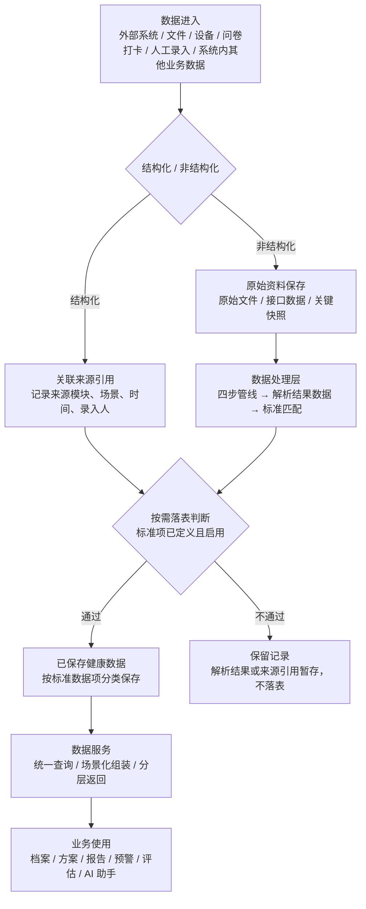
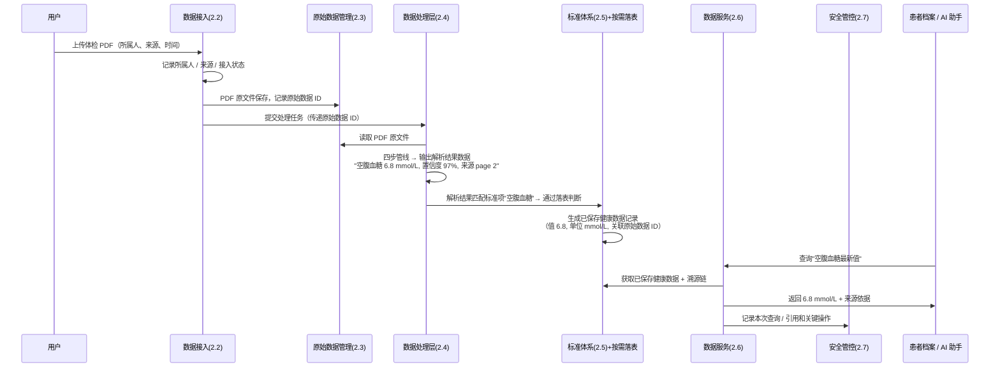

# 健康数据中心产品方案

## 文档导读

本文从产品视角定义“健康数据中心”的建设目标、业务边界、产品原则、能力范围和后续待决策问题，用于帮助研发、产品、实施和业务协作伙伴理解健康数据中心为什么建设、管理什么数据、提供什么能力，以及如何与业务模块协作。

本文非技术实现方案，主要作用为与研发对齐预期效果，不约定技术上的具体实现方式。

另外，本文档将作为产品内部持续建设数据中心与相关联业务功能时的核心遵循原则。

# 1. 产品概述

## 1.1 简介说明

健康数据中心是一个面向健康管理业务的数据底座能力，用于统一接收、保存、加工、标准化和服务患者相关健康数据。

凡是系统内需要读取、写入、分析或引用健康数据的场景，原则上都应通过健康数据中心形成统一数据口径。

## 1.2 核心目标

- 把多来源、异构、非标准、非结构化或半结构化的健康数据，保存为可查询、可追溯、可治理、可被业务复用的健康数据。

- 支持健康管理业务在建档、评估、制定方案、随访、报告生成、阶段复盘和 AI 辅助等多个环节，复用同一批健康数据。

- 构建从数据进入、原始保留、加工保存、业务使用到追溯审计的稳定产品链路。

## 1.3 建设原则

- **原始资料必须保存**：不能只保存加工后的结果，条件允许时必须保存原始资料数据，支撑复核、追溯、重加工和审计。
- **按需保存健康数据**：不追求全量结构化，只保存会被业务使用、需要长期追踪、需要复用或需要审计的数据。
- **多来源数据并存**：同一健康指标或健康事实允许多来源数据共存（如院内系统、自行上传报告、设备测量分别记录的空腹血糖），健康数据中心保留所有来源数据及其来源信息，不覆盖。具体业务场景采用哪条数据由业务侧决策，数据中心不负责判断。
- **保持拓展性**：数据标准、处理规则、外部对接方式随业务模块同步升级，新增指标、新增数据源、新增业务场景时可扩展而不推翻已有链路。

# 2. 核心能力模块

本章定义健康数据中心需要建设的产品能力。“能力”不等同于技术视角的架构模块，研发可根据架构定义技术框架和实现方式。

## 2.1 能力模块概览

健康数据中心的核心能力围绕“数据进入、来源保留、解析标准化、按需保存、业务供给、使用留痕”展开。

| 能力模块         | 能力定位                              | 主要内容                                | 边界说明                                            |
| ------------ | --------------------------------- | ----------------------------------- | ----------------------------------------------- |
| 2.2 数据接入模块   | 统一定义健康数据如何进入数据中心，以及如何记录来源和跟踪接入过程  | 多源接入管理、外部系统拉取保障                     | 负责接收、校验、来源记录和接入状态管理；结构化数据进入按需落表链路，非结构化数据进入数据处理层 |
| 2.3 原始数据管理模块 | 保留进入数据中心的原始资料和来源依据，支撑回看、复核、追溯和重加工 | 原始数据接收、保存、索引、分类存储、只读保全、来源关联         | 不触发 AI 解析任务，不存储解析结果；纯结构化值不经过本层，落表时直接挂来源引用       |
| 2.4 数据处理模块   | 将非结构化数据转为解析结果数据，并完成标准匹配与落表判断      | 结构化处理、标准化处理、候选匹配记录、按需落表判断           | 不定义需要处理哪些数据；标准化只处理 AI 解析结果数据，不处理系统内已结构化写入的数据来源  |
| 2.5 标准数据体系   | 定义健康数据在系统中的统一表达口径                 | 标准数据分类、标准数据项属性、别名/同义词、来源映射规则、生命周期状态 | 只定义标准，不处理患者实际数据，不负责业务取数优先级、权限控制和审计              |
| 2.6 数据服务模块   | 作为健康数据中心面向业务的统一数据出口               | 统一查询、场景化组装、分层返回、溯源随行、上下文供给          | 不生产数据、不修改已保存数据；业务结论、风险判断和展示优先级由具体业务场景决定         |
| 2.7 安全管控模块   | 记录健康数据使用过程，支撑历史解释、追责和审计           | 查询、引用、修正、导出、共享等过程的留痕和审计要求           | 不重复建设权限体系；用户、角色、组织、租户等权限判断由系统权限模块负责；本能力按需建设     |

## 2.2 数据接入模块

能力目标：定义哪些健康数据可以进入健康数据中心，以及如何进入、如何记录来源、如何跟踪接入过程。

边界说明：数据接入是健康数据中心的统一入口，负责接收、校验、来源记录和状态管理。结构化数据接入后进入按需落表链路，非结构化数据进入数据处理层。

### 2.2.1 多源接入管理

**接入原则**（什么能进、什么不能进）：

本节用于为后续业务功能接入提供产品判断依据。

- 【允许】健康档案核心数据（病历资料、健康指标等）。
- 【允许】健康管理业务会复用、追踪、分析、引用或审计的数据。
- 【允许】系统内结构化数据可直接接入，遵循按需落表。
- 【限制】纯业务过程状态不构成健康事实的数据。
- 【限制】临时计算结果无需追溯的数据。
- 【限制】与健康管理无核心相关的运营、营销、流程或权限数据。
- 【待定】用户行为等数据（按业务需要再定）。

**主要的来源渠道与数据种类**

| 来源渠道      | 主要数据种类                              | 主要数据格式                                   | 接入方式                      | 关键机制                                                                |
| --------- | ----------------------------------- | ---------------------------------------- | ------------------------- | ------------------------------------------------------------------- |
| 外部信息系统    | 就诊人基础档案数据、病历档案、检验检查报告、体检报告、处方等      | JSON、PDF、XML、图片（图片通常是检查报告附件，如超声报告中的若干图片） | API                       | 系统主动向外部拉数据（院内通常不做推送，需定时拉取，不同医院入参差异极大）                               |
| 系统内部病历资料  | 同外部系统数据种类基本一致                       | 图片、PDF                                   | 系统内写入                     | 前台功能上传后直接归档到数据中心                                                    |
| 物联设备      | 身体体征或检测检验数据：血压、血糖、体重、体脂、运动、睡眠等      | 字符串（厂商提供解析规则，需自行解析）                      | 云端 API / 设备蓝牙直传（由系统内业务写入） | 不同接入方式数据流转路径有差别，技术设计上需做好兼容；解析需按厂商-设备型号定制，无法通用；需记录设备、采集时间、单位、频率和厂商来源 |
| 系统内其他业务数据 | 问卷填写、智能/人工外呼（通话录音+AI转写）、打卡记录、任务执行结果 | 结构化字段 + 文本/音频文件                          | 系统内写入                     | 场景差异较大，需要按业务逐一消化；核心原则：结论性健康数据进入数据中心，过程性数据留在业务模块（方向性界定，待进一步理清）       |

### 2.2.2 外部系统对接专门说明

外部系统（尤其是院内系统）是健康数据的主要来源，也是健康数据中心所有接入渠道中最不可控的一类。以下从问题、策略、保障三个层面说明，核心目标降低异常风险情况发生。

**接入限制**

- 对方不推送：院内系统通常不支持主动推送数据，需要我方定时拉取，数据时效性取决于拉取频率。
- 接口无标准：不同医院、不同厂商的接口入参、返回格式、分页方式、错误码体系各不相同，无法用一套通用逻辑覆盖。
- 稳定性不可控：院内系统存在负载高峰、网络抖动、接口变更不通知等情况，存在拉取中断、超时导致拉取异常（漏拉或无法拉取）。
- 数据完整性难验证：对方是否返回了全部数据、是否有遗漏，仅靠技术手段无法百分之百确认——我们只能感知“与预期的偏离”，无法感知“对方有而我不知的数据”。

**对接策略**

- 对接粒度：由字段级对接调整为获取完整院内原始数据，由数据中心自行解析、识别和标准化。如客户仅能提供字段级数据，也须同步记录字段来源、来源系统和对应文档关系。
- 对接前摸底：与医院信息科确认数据量级、更新频率、接口能力边界，作为后续比对和异常判断的基线参考。
- 拉取模式：系统主动向外部系统拉数据（院内通常不做推送），需支持定时拉取，按来源系统独立配置拉取窗口和频率。

**拉取保障**

- 拉取控制：按来源系统配置调用间隔和并发上限，支持分时间窗口、分数据类型增量拉取，避免瞬时高并发压垮对方系统。
- 完整性校验：每次拉取完成后比对实际收到数据与预期数据——对方返回的 totalCount 等元信息、历史同期的数据量基线、关键字段缺失率。出现显著偏离时触发告警。
- 异常重试：校验未通过或拉取中断 → 自动进入重试队列，采用递增退避间隔；多次重试仍失败 → 标记“部分完成”，已拉数据先保存可用，未拉到的缺口明确记录，转人工介入。

## 2.3 原始数据管理模块

能力目标：统一管理进入健康数据中心的原始数据，保留数据来源依据，支撑回看、复核、追溯、审计和后续重加工。**保存只是手段，保全和可追溯才是目的。**

边界说明：

- 负责原始数据的接收、保存和索引，确保原始数据一旦保存不可修改，并向下游提供可追溯的关联锚点。

- 本层不触发 AI 解析任务，不负责解析结果数据的存储。

- 纯结构化值（如打卡记录的数值、人工录入的测量值）不经过本层，落表时直接挂来源引用即可。

核心要求：

- 原始数据采用“统一索引 + 分类型存储”：
  
  - 统一索引：所属人/患者标识（允许暂未匹配状态）、来源渠道、来源系统、资料类型、接入方式、接入批次、接入时间、处理状态和关联关系。
  
  - 数据类型示例：
    
    - 病历资料
    - 物联数据原始数据
    - 问卷采集原始数据
    - 外呼录音文件
    - 其他后续接入类型

- 原始内容要求能通过统一索引被检索、回看和追溯。

- 新增数据来源或数据格式时，优先归入已有类型，已有类型无法容纳时，按业务含义新增类型。

- 原始数据保存后即为只读，任何后处理动作都不能反写修改原始数据。

- 同一份原始数据可被多次解析，支持后续规则升级、模型迭代时重新处理。

## 2.4 数据处理模块

能力目标：将非结构化数据转为解析结果数据；在此基础上完成标准匹配与落表判断。

边界说明：包含两个子模块

- **数据结构化子模块**：负责将非结构化数据转为解析结果数据，回答“文档里写了什么”；

- **数据标准化子模块**：负责将解析结果数据匹配到标准项并判断是否落表，回答“对应哪个标准项、该不该落表”。

- 两者解耦：可实现基于结构化结果多次触发执行标准化，不需要重跑整条管线。

特别说明：本模块不负责定义需要处理哪些数据，具体由业务定义。

### 2.4.1 结构化处理

结构化处理分为以下步骤：

1. 预处理：格式归一化、图片增强、编码转换，输出标准化文档页面。
2. 文本抽取：数字 PDF 直接提取文本，扫描件/拍照件走 OCR，OCR 结果经语义校正，输出全文文本。
3. 数据结构化：从全文中抽取医学实体及属性，语境检测；按抽取结果组装 JSON，标注置信度和来源依据，原文回验。输出解析结果数据。
4. 保存与输出：解析结果数据保存，传递至数据标准化子模块。

### 2.4.2 标准化处理

能力目标：对 AI 解析结果数据统一转化并映射到标准数据体系中可识别、可追踪、可复用的标准表达。

边界说明：本子模块只处理 AI 解析结果数据，不处理系统内已结构化写入的数据来源。

**标准化处理内容：**

- **标准项**：将解析结果中的原始项目名、别名、缩写或来源字段，匹配到标准数据体系中的标准数据项。
- **值类型**：识别结果值属于数值、范围、阴阳性、枚举、文本等哪类表达。
- **时间**：区分检测时间、报告时间、上传时间和记录时间，避免不同时间语义混用。
- **来源**：基于解析结果中的来源依据，记录来源类型、来源资料、来源位置和来源片段。
- **单位**：当前阶段保留原始单位，并关联标准数据项的参考单位；是否进行单位换算后续再确认。
- **候选匹配记录**：当无法确定唯一标准项时，记录候选标准项、匹配依据和未确认原因，便于后续人工判断、规则优化和标准体系扩展。

**候选匹配记录：**

对于无法稳定确认标准项的解析结果，系统不应直接丢弃，而应保留候选匹配信息，包括候选标准项、匹配依据和未确认原因。

候选匹配记录用于支持后续标准体系治理，例如补充别名、调整来源映射规则、新增标准数据项或触发历史解析结果重加工。

**落表策略：**

核心原则：按需落表，由业务统一定义。

**置信度策略：**

标准化的置信度策略影响后续流程和动作，如自动落表或人工复核，但当前暂不作为优先建设项，由研发结合模型能力评估确定。

## 2.5 标准数据体系

能力目标：建立健康数据中心的统一数据口径，定义系统可识别、可标准化、可复用的健康数据单元，为 AI 解析结果标准化、按需保存健康数据和业务统一取数提供依据。

边界说明：本模块负责定义标准，不直接处理患者实际数据。

### 2.5.1 概述

标准数据项是标准数据体系的最小管理单元，用于定义一个健康数据在系统中的标准表达。标准数据项不等于患者实际数据。标准数据项定义“空腹血糖”这个数据应如何表达，实际的数据记录某个患者在某个时间、某个来源下的实际空腹血糖值。

标准数据体系应以已有行业标准为基础，按健康管理业务需要筛选、裁剪和补充；具体引用关系见 [4.1 行业标准对标清单](#41-行业标准对标清单)。

### 2.5.2 标准数据分类体系

该分类以 WS/T 363、WS/T 364、WS 446、ICD、医保药品编码等标准为基础，结合健康管理业务场景做的产品化分类。

数据项分类只是为了方便管理，系统核心使用的是数据项本身，而非分类。

| 一级分类         | 范围                         | 典型数据项                                   |
| ------------ | -------------------------- | --------------------------------------- |
| 1. 生命体征与体格测量 | 基础生命体征、身体形态、体格测量           | 血压、心率、体温、呼吸频率、SpO2、身高、体重、BMI、腰围         |
| 2. 实验室检验     | 血液、尿液、粪便、分泌物等标本检验结果        | 血糖、糖化血红蛋白、血脂、尿酸、肌酐、ALT、AST、血常规、尿常规、血气分析 |
| 3. 医学检查与功能评估 | 影像、心电、超声、肺功能、骨密度等检查或功能测试结果 | 肺功能指标、骨密度 T 值、心电图指标、超声测量值、眼底检查结果        |
| 4. 疾病、诊断与健康史 | 现病史、既往史、诊断、家族史             | 高血压、糖尿病、冠心病、肿瘤史、家族遗传病史                  |
| 5. 用药与过敏     | 当前用药、历史用药、药物过敏、食物/环境过敏     | 药品名称、剂量、用法、起止时间、过敏原、过敏反应                |
| 6. 手术与医疗操作   | 手术史、治疗操作、介入操作、检查操作         | 手术名称、手术日期、支架植入、内镜操作                     |
| 7. 生活方式与行为   | 饮食、吸烟、饮酒、运动、睡眠等生活方式数据      | 吸烟状态、饮酒频率、运动频率、步数、睡眠时长、睡眠质量、饮食结构        |
| 8. 健康评估与管理标签 | 问卷量表、风险评估、健康标签、管理分层        | 问卷评分、风险等级、依从性标签、慢病管理等级、干预标签             |

### 2.5.3 标准数据项属性模型

每个标准数据项至少包含以下属性：

| 属性       | 说明                      | 示例（空腹血糖）                    |
| -------- | ----------------------- | --------------------------- |
| 标准中文名称   | 系统内唯一的标准中文名称            | 空腹血糖                        |
| 标准编码     | 系统内标准编码，可参考行业标准编码       | DE04.50.001.00              |
| 别名/同义词列表 | 可被识别为该标准项的替代名称、缩写或常见写法  | [FPG, 葡萄糖(空腹), GLU, 空腹血糖测定] |
| 数据分类     | 所属业务健康含义分类              | 实验室检验                       |
| 数据表现类型   | 数值型 / 范围型 / 枚举型 / 文本型   | 数值型                         |
| 是否可量化    | 是否适合计算、统计或趋势追踪          | 是                           |
| 参考单位     | 数值型数据的参考单位，非数值型可为空      | mmol/L                      |
| 取值约束     | 数值范围、枚举选项、格式要求等         | 3.9-6.1 mmol/L              |
| 关联健康主题   | 可服务的健康管理主题，可多选          | [代谢管理, 糖尿病管理, 心血管管理]        |
| 生命周期状态   | 草稿 / 启用 / 停用 / 合并 / 替代  | 启用                          |
| 来源映射规则   | 已知来源系统、报告模板或字段名到本标准项的映射 | HIS_X: GLU_F; 报告模板A: 空腹血糖测定 |
| 适用来源类型   | 该标准项常见或允许的来源类型，可多选      | 院内系统 / 文件上传                 |
| 适用采集方式   | 该标准项常见或允许的采集方式，可多选      | 一次性 / 自测                    |

说明：

- 别名/同义词用于解决同义不同名问题。
- 来源映射规则用于解决不同系统、不同报告模板字段不一致问题。
- 数据表现类型描述数据值如何表达；枚举型可覆盖是/否、有/无、阴性/阳性等二值选项。
- 是否可量化用于判断数据是否适合统计、计算和趋势追踪，不作为一级分类依据。
- 参考单位主要适用于数值型数据，非数值型数据可为空。
- 取值约束可用于数值范围、枚举选项、格式校验和异常提示，不直接作为诊断结论。
- 适用来源类型和适用采集方式用于描述该标准项通常支持哪些来源和采集方式，不表示该标准项固定属于某个来源。
- 关联健康主题用于支持按健康管理场景组织数据，例如空腹血糖可同时用于代谢管理、糖尿病管理和心血管风险评估。

### 2.5.4 标准体系维护备注

- 标准体系按业务需要增量建设，不追求一次性覆盖所有健康数据。

- 标准数据项、别名、分类和来源映射前期以人工维护为主，后续基于高频未匹配项持续补充标准项和匹配规则。

- 标准数据项应支持启用、停用、合并或替代等生命周期状态，避免历史数据失去解释依据。

## 2.6 数据服务模块

能力目标：作为健康数据中心面向业务的数据统一出口，提供健康数据查询、场景化组装、分层返回和来源依据供给能力。

边界说明：

- 本模块不生产数据、不定义标准数据项、不修改已保存数据。
- 标准数据项由 2.5 定义；已按需落表的数据由本模块按业务场景统一组织后供给。
- 业务结论、风险判断和展示优先级由具体业务场景决定。

供给内容：根据业务场景需要返回已保存健康数据、解析结果、原始资料、来源依据等。

核心能力：

| 能力    | 说明                                            |
| ----- | --------------------------------------------- |
| 统一查询  | 支持按患者、标准数据项、数据分类、时间范围、来源、业务场景查询健康数据           |
| 场景化组装 | 面向健康报告、患者档案摘要、风险预警、阶段评估等高频复杂场景，按规则组织数据包       |
| 分层返回  | 支持按需要返回已保存健康数据、解析结果、原始资料和来源依据，满足展示、分析、复核等不同用途 |
| 溯源随行  | 返回数据时同步带出来源、证据片段、质量状态、修正记录等信息                 |
| 上下文供给 | 支持报告生成、规则计算、AI 调用等使用方式获取所需上下文，避免只给结论不给依据      |

## 2.7 安全管控模块

能力目标：记录健康数据被业务使用、引用、修正、导出和共享的过程，保证历史结果可解释、关键操作可追责、合规审计有依据。

边界说明：

- 本模块不负责标准体系维护、数据处理、数据按需保存和数据服务供给。
- 用户、角色、组织、租户等权限判断由系统权限模块统一负责。
- 本模块只定义健康数据使用过程中的留痕和审计要求，不重复建设权限体系。

建设说明：当前暂不作为优先建设项，按需建设。

# 3. 业务场景模拟示例

## 3.1 数据流转示意图

**数据流转的四个关键约束**：

- 数据进入后首先判断数据类型：结构化数据直接走来源引用 + 按需落表，不进入 AI 解析链路；非结构化数据先保存原始资料再进入处理层。两条路径仅在按需落表判断处汇合。
- 无论哪种路径，都必须保留来源依据：非结构化数据保留原始资料，结构化数据记录来源引用。这是后续追溯、复核、重加工的基础。
- 只有通过按需落表判断的数据，才按标准数据项保存为可复用健康数据。未通过的数据保留解析结果或来源引用，不落表。
- 业务模块不直接绕过数据服务取数，应通过 2.6 数据服务统一取数。

## 3.2 数据旅程示例

以下用一份体检 PDF 从上传到被业务使用的完整旅程作为示例。

> **场景**：患者上传一份体检 PDF，系统需要识别其中的“空腹血糖 6.8 mmol/L”，最终供 AI 助手和患者档案使用。

# 4. 附录

## 4.1 行业标准对标清单

本附录用于说明不同标准数据项应遵循或参考哪些行业标准，以及这些标准应引用到标准数据项的哪些属性中。

### 4.1.1 引用方式说明

| 引用方式 | 含义                           |
| ---- | ---------------------------- |
| 直接引用 | 标准名称、编码、单位、取值约束等可直接作为标准数据项属性 |
| 映射引用 | 本系统保留自有标准项，同时映射行业编码或国际编码     |
| 参考建模 | 参考其数据范围、字段结构或文档模板，不直接照搬      |
| 术语补充 | 用作别名、同义词和未匹配项治理来源            |
| 解析参考 | 用于外部文档解析字段预期，不作为标准项定义依据      |

### 4.1.2 标准数据项分类对照

| 标准数据项分类   | 典型数据项                                   | 主要依据                         | 补充依据            | 引用方式        | 引用到的属性                     | 参考链接                                                                                                                                                                                                   |
| --------- | --------------------------------------- | ---------------------------- | --------------- | ----------- | -------------------------- | ------------------------------------------------------------------------------------------------------------------------------------------------------------------------------------------------------ |
| 生命体征与体格测量 | 血压、心率、体温、呼吸频率、SpO2、身高、体重、BMI、腰围         | WS/T 363、WS/T 364、WS 365     | GB/T 40423      | 直接引用 / 参考建模 | 标准名称、参考单位、取值约束、数据分类        | [WS/T 363/364](https://www.nhc.gov.cn/fzs/c100048/202310/16a32e2b1c0b42e99480b945ef10c0dc.shtml)、[GB/T 40423](https://openstd.samr.gov.cn/bzgk/gb/newGbInfo?hcno=B1B83EE90C5043BDF434610CBA69E48E)     |
| 实验室检验     | 血糖、糖化血红蛋白、血脂、尿酸、肌酐、ALT、AST、血常规、尿常规、血气分析 | WS/T 363.9、WS/T 364.9、WS 446 | LOINC           | 直接引用 / 映射引用 | 标准名称、标准编码、参考单位、取值约束、来源映射规则 | [WS/T 363.9](https://www.nhc.gov.cn/wjw/s9497/202311/8703cc352e8f409db932e45192ce2ca2.shtml)、[WS 446](https://www.spc.org.cn/online/531a0e59fbee852a91cbe51ca4bb2d63.html)、[LOINC](https://loinc.org/) |
| 医学检查与功能评估 | 肺功能指标、骨密度 T 值、心电图指标、超声测量值、眼底检查结果        | WS 445、WS/T 500              | GB/T 40423      | 参考建模 / 解析参考 | 数据分类、数据表现类型、检查项目、结果字段、报告结构 | [WS 445](https://www.nhc.gov.cn/ewebeditor/uploadfile/2014/06/20140620111008557.PDF)、[GB/T 40423](https://openstd.samr.gov.cn/bzgk/gb/newGbInfo?hcno=B1B83EE90C5043BDF434610CBA69E48E)                 |
| 疾病、诊断与健康史 | 高血压、糖尿病、冠心病、肿瘤史、家族遗传病史                  | ICD-11 中文版                   | WS/T 363、WS 365 | 直接引用 / 参考建模 | 标准编码、标准名称、数据分类、生命周期状态      | [ICD-11](https://icd.who.int/zh/)、[WS/T 363/364](https://www.nhc.gov.cn/fzs/c100048/202310/16a32e2b1c0b42e99480b945ef10c0dc.shtml)                                                                     |
| 用药与过敏     | 药品名称、剂量、用法、起止时间、过敏原、过敏反应                | 医保药品编码（YB）                   | WS 445、WS/T 363 | 直接引用 / 参考建模 | 标准编码、标准名称、别名、数据分类、来源映射规则   | [医保编码标准](https://code.nhsa.gov.cn/lib/img/file1/attachment.pdf)、[WS 445](https://www.nhc.gov.cn/ewebeditor/uploadfile/2014/06/20140620111008557.PDF)                                                   |
| 手术与医疗操作   | 手术名称、手术日期、支架植入、内镜操作                     | ICD-9-CM3（医保版）               | WS 445          | 直接引用 / 参考建模 | 标准编码、标准名称、数据分类、来源映射规则      | [医保编码标准](https://code.nhsa.gov.cn/lib/img/file1/attachment.pdf)、[WS 445](https://www.nhc.gov.cn/ewebeditor/uploadfile/2014/06/20140620111008557.PDF)                                                   |
| 生活方式与行为   | 吸烟状态、饮酒频率、运动频率、步数、睡眠时长、睡眠质量、饮食结构        | WS 365、WS/T 483              | WS/T 363        | 参考建模        | 数据分类、数据表现类型、取值约束、关联健康主题    | [WS/T 483](https://www.nhc.gov.cn/wjw/s9497/201607/27c831e924d04c95b8cb66617d2b572b.shtml)、[WS/T 363/364](https://www.nhc.gov.cn/fzs/c100048/202310/16a32e2b1c0b42e99480b945ef10c0dc.shtml)            |
| 健康评估与管理标签 | 问卷评分、风险等级、依从性标签、慢病管理等级、干预标签             | WS/T 483、WS 365              | 自有扩展            | 参考建模 / 自有扩展 | 数据表现类型、取值约束、关联健康主题、生命周期状态  | [WS/T 483](https://www.nhc.gov.cn/wjw/s9497/201607/27c831e924d04c95b8cb66617d2b572b.shtml)                                                                                                             |

### 4.1.3 相关参考标准

| 标准/指南               | 主要用途              | 是否作为标准数据项依据 | 参考链接                                                                                                                                                                                     |
| ------------------- | ----------------- | ----------- | ---------------------------------------------------------------------------------------------------------------------------------------------------------------------------------------- |
| WS/T 500 电子病历共享文档规范 | 外部文档解析字段预期、报告结构参考 | 否，主要用于解析参考  | [WS/T 500 相关资料](https://www.nhc.gov.cn/)                                                                                                                                                 |
| OMAHA 七巧板术语集        | 别名、同义词、未匹配项补充     | 否，作为术语补充来源  | [OMAHA 术语资料](https://www.bobinsun.cn/assets/pdf/OMAHA%E4%B8%83%E5%B7%A7%E6%9D%BF%E4%B8%AD%E6%96%87%E4%B8%B4%E5%BA%8A%E6%9C%AF%E8%AF%AD%E9%9B%86%E5%85%A5%E9%97%A8%E6%8C%87%E5%8D%97.pdf) |

---

## 4.2 术语表

| 术语      | 定义                                                                               | 参考章节      |
| ------- | -------------------------------------------------------------------------------- | --------- |
| 解析结果数据  | AI 解析原始数据后生成的结构化 JSON 中间产物，记录“识别到了什么、依据是什么、可能对应哪个标准项、当前处理状态是什么”。不是正式健康数据，也不直接落表。 | 2.4.1     |
| 按需落表    | 按业务需要将标准化结果保存为可复用健康数据的原则，不追求全量结构化。                                               | 2.4.2     |
| 标准数据项   | 在标准数据体系中唯一定义的、可被系统识别和复用的健康数据单元，包含标准名称、编码、别名、数据表现类型、单位、值域、关联主题等完整属性。              | 2.5       |
| 已保存健康数据 | 通过按需落表判断后保存的健康数据记录，按标准数据项分类，可被数据服务统一供给。                                          | 2.4.2、2.6 |
| 原始资料    | 进入系统的原始文件、原始接口数据、原始设备数据或系统内来源记录的总称，保持原貌不修改，是后续追溯、复核和重加工的基础。                      | 2.3       |
| 来源引用    | 从已保存健康数据或业务使用结果回溯到原始资料位置的关联记录，包含原始数据 ID、页码、区域、字段路径或原文片段等信息。                      | 2.3、2.6   |
| 引用快照    | 业务使用健康数据时的数据状态副本，用于在源数据后续发生变化后仍能解释历史业务结果。                                        | 5.6       |
| 处理批次    | 一次数据处理操作的统一标识，用于关联同一批次的处理结果，支持批次级问题排查和结果对比。                                      | 5.3       |
| 标准匹配    | 将解析结果项的名称、单位、类型等信息与标准数据体系的已知标准项进行比对，确定“应该标准化成什么”的规范化过程。                          | 2.4.2     |
| 置信度策略   | 基于解析结果置信度影响后续处理动作的策略，当前暂不作为优先建设项，由研发结合模型能力评估。                                    | 2.4.2、5.4 |
| 租户归属    | 用于描述健康数据在租户间的归属和隔离关系。具体归属模型见 5.1，权限落地规则见 5.7。                                    | 5.1、5.7   |

# 5. 后续待决策与备忘

本章统一收口全文未决策事项和后续建设备忘。以下内容按能力模块聚合，只记录需要进一步确认、细化或进入技术方案的事项。

优先级说明：

- **P0**：技术方案或数据模型启动前必须确认。
- **P1**：一期详细 PRD 或接口设计前建议确认。
- **P2**：可延后到后续版本、规则优化或运营治理阶段。

## 5.1 全局前置决策

- [P0] 数据归属模型：采用“租户归属为主 + 患者授权共享为辅”，还是直接走向“患者归属 + 授权访问”。
- [P0] 外部数据所属患者确认策略：外部系统数据如何识别和确认所属患者，未匹配数据如何保存和后续处理。

## 5.2 数据接入模块备忘（对应 2.2）

- [P1] 外部系统是否保留字段级对接模式；如保留，需同步记录字段来源、来源系统和对应资料关系。
- [P1] 重复拉取的院外数据如何识别、排重和合并。
- [P2] 用户行为数据是否纳入健康数据中心。

## 5.3 原始数据管理模块备忘（对应 2.3）

- [P1] 原始资料重加工后的结果更新策略。
- [P1] 原始数据索引字段和处理批次定义。

## 5.4 数据处理模块备忘（对应 2.4）

- [P1] 异常、未匹配、低置信度和处理失败数据的提示与处理方式。
- [P1] 处理失败后是否需要重新提交、人工补录或人工确认。
- [P1] 管线失败状态机和解析结果数据处理状态枚举。
- [P1] 标准化结果类型定义，包括自动落表、待复核、暂不落表、匹配失败、处理失败等状态。
- [P1] 单位标准化和单位换算启用规则。
- [P2] 置信度策略与标准匹配的关系。

## 5.5 标准数据体系备忘（对应 2.5）

- [P0] 第一批标准数据项范围，是否围绕血压、血糖、血脂、尿酸、体重形态，以及病史、用药、过敏、生活方式、标签等高频数据建设。
- [P1] 高频未匹配项如何进入标准数据项、别名和来源映射规则治理。
- [P1] 候选匹配记录如何反哺标准体系维护。

## 5.6 数据服务模块备忘（对应 2.6）

- [P1] 主要业务场景取数口径，覆盖患者档案、健康报告、方案生成、风险预警、阶段评估等场景。
- [P1] 业务模块取数时，如何区分最新值、指定来源值和业务指定值。
- [P1] 跨指标、跨来源、跨时间查询能力边界。
- [P1] 报告、方案、预警、评估等历史结果引用数据后，是否需要形成引用快照并锁定引用时刻值。

## 5.7 安全管控模块备忘（对应 2.7）

- [P1] 租户隔离、跨租户授权访问和患者授权原则。
- [P1] 患者授权、机构授权、医生授权之间的边界。
- [P1] 原始资料查看权限与已保存健康数据查看权限的关系。
- [P1] 人工修正是否必须填写原因，是否需要审核。
- [P1] 数据被人工修正后，历史报告、方案或评估是否同步变化。
- [P1] 脱敏触发时机、脱敏范围和脱敏方式。
- [P2] 已引用数据发生变化后是否提醒业务人员。
