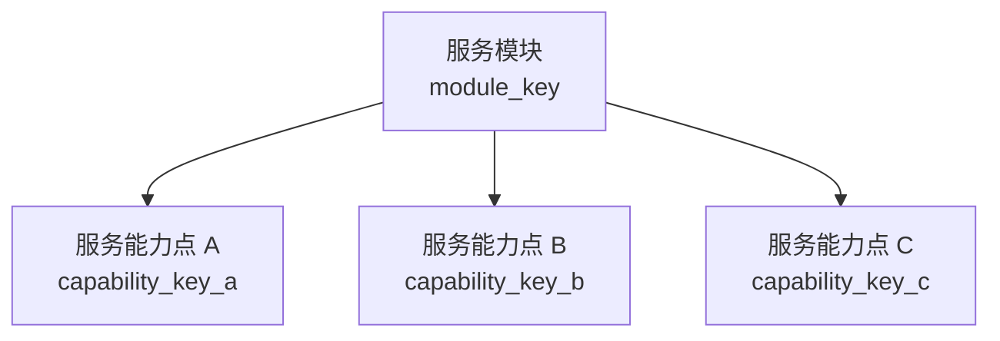

# 【PRD】租户服务配置 2.0

## 文档导读

本文定义健康管理平台多租户场景下“模块配置”的产品目标、业务边界、核心概念和建设范围，用于对齐产品、研发、测试、实施和运营的建设口径。

模块配置不是菜单开关，也不是角色权限体系。它是 M 端面向租户的底层能力配置，用于管理不同租户是否开通某项业务能力。

模块配置以“服务模块 - 服务能力点 - 端侧受控对象”为核心模型。服务模块用于归类业务域，服务能力点用于表达租户是否拥有某项业务能力，端侧受控对象用于承接该能力在 B 端、C 端或模型工具中的实际受控落点。

配置发布后，B 端、C 端和模型工具按同一套服务能力点编码控制可见性和可用性，避免多端重复配置、端侧控制不一致和历史链接绕过等问题。

# 1. 需求概述

## 1.1 业务背景

健康管理平台是多租户平台。平台具备完整业务能力，但不同租户因采购范围、业务形态、实施阶段和运营策略不同，实际开放的功能并不一致。

因此，平台需要支持按租户配置可用功能，让不同租户在同一套系统中拥有不同的功能范围。

## 1.2 效果概述

在 M 端为某个租户开启或关闭一项服务能力，系统应自动联动相关 B 端入口、C 端入口和模型工具等端侧受控对象，不需要在多个端侧或多个页面中重复配置。

以“服务包模块”为例，关闭该模块后，系统应同步处理以下范围：

| 影响范围  | 预期表现                     |
| ----- | ------------------------ |
| B 端   | 服务包管理、订单管理等服务相关入口不可见或不可用 |
| C 端   | 服务入口、订单入口、订阅入口等不可见或不可用   |

系统需要避免出现以下状态：

- 某个端侧已经关闭，另一个端侧仍然可见。
- 菜单已经不可见，但用户通过历史链接仍能访问。
- 同一业务能力需要在多个位置分别维护开关。

## 1.3 能力配置与角色权限边界

模块配置回答：

> 这个租户有没有这个功能？

角色权限回答：

> 在租户已拥有该功能的前提下，某个用户能不能查看、创建、编辑、删除或审批？

租户未启用某功能时，即使用户角色拥有权限，也不可见、不可用。具体可见、可用判断规则见“3.4 端侧受控对象与权限的关系”。

# 2. 建设目标与原则

## 2.1 核心目标

- 支持平台为不同租户配置不同的业务能力。
- 支持一个业务模块关闭后，B 端、C 端和模型工具统一生效。
- 支持父子层级校验，避免服务能力点在上级服务模块关闭时仍然生效。

## 2.2 产品原则

- **按业务能力配置，不按页面配置**：配置对象是业务能力，不是某个菜单、页面或按钮。
- **一处配置，多端生效**：M 端配置租户业务能力，B 端、C 端和模型工具统一按服务能力点编码控制可见与可用。
- **轻量能力中心优先**：不建设完整商业 Feature Flag 平台，而是建设轻量的租户功能能力中心。
- **运行时校验必须存在**：端侧隐藏只改善体验，不能作为安全边界。
- **历史数据默认保留**：模块关闭不等于删除历史数据，但关闭后相关功能对该租户完全不可见、不可用。

## 2.3 纳入范围

纳入范围遵循以下原则：

- 不把模块配置建设成全量功能目录。
- 只纳入需要租户差异化配置、需要跨端联动关闭的业务能力。
- 不能关闭的核心必选功能不纳入模块配置清单。

# 3. 产品概念模型

## 3.1 概念定义

模块配置由三类核心对象组成：

| 概念 | 说明 | 示例 |
| --- | --- | --- |
| 服务模块 | 一组业务能力的上层归类，用于控制该业务域是否整体开放 | 服务包模块、AI 客服模块 |
| 服务能力点 | 租户能力配置的最小业务单元，用于判断租户是否拥有某项业务能力 | 服务包管理、订单管理、智能导诊、预问诊 |
| 端侧受控对象 | 服务能力点在系统中的实际受控落点，用于承接页面、元素或模型工具等具体控制对象 | 订单管理页面、订阅入口、智能导诊模型工具 |

服务模块和服务能力点是上下级关系。服务能力点和端侧受控对象是业务能力与系统落点的映射关系。

在服务业务场景中，“服务包模块”是一个服务模块实体；“服务包管理”是服务包模块下的一项服务能力点，不等同于服务包模块本身。

服务能力点 key 是服务能力点的稳定标识，用于租户能力配置和运行时能力校验。端侧受控对象 key 是系统受控落点的稳定标识，用于定位服务能力点实际控制的页面、元素或模型工具。

服务能力点 key 和端侧受控对象 key 不是同一个概念，需要在配置模型中区分维护。服务能力点属于租户能力层，端侧受控对象属于系统受控落点层。B 端角色权限可以建立在端侧受控对象之上，但端侧受控对象本身不等同于权限点。

## 3.2 服务模块与服务能力点

服务模块可以按父子层级组织：父级模块控制一组业务能力是否整体开放，服务能力点控制该业务域下的具体能力。

服务模块具有独立启用状态，同时与其下服务能力点存在父子级联动关系。服务能力点开启时，其父级服务模块必然开启；父级服务模块关闭时，其下属服务能力点必然全部关闭。



父子关系规则：

```text
关闭父级服务模块
-> 其下属服务能力点全部关闭，运行时整体不可用

开启任一服务能力点
-> 其父级服务模块自动开启

开启父级服务模块，但关闭某个服务能力点
-> 该服务能力点相关功能不可用
-> 其他已开启的服务能力点仍可按配置使用
```

服务业务示例：

```text
服务包模块
- B 端服务包管理
- B 端订单管理
- C 端订单入口
- C 端订单管理
- C 端订阅
```

含义说明：

- 服务包模块：用于批量控制服务包相关服务能力点，本身不直接对应端侧受控对象。
- B 端服务包管理：服务包模块下的具体服务能力点，用于控制 B 端服务包配置与管理功能。
- B 端订单管理：服务包模块下的具体服务能力点，用于控制 B 端服务包订单管理功能。
- C 端订单入口：服务包模块下的具体服务能力点，用于控制 C 端服务包订单入口。
- C 端订单管理：服务包模块下的具体服务能力点，用于控制 C 端服务包订单列表和详情。
- C 端订阅：服务包模块下的具体服务能力点，用于控制 C 端订阅入口和订阅记录。

当前模型只处理父子层级关系，不处理跨模块依赖、互斥、组合启用等复杂规则。

## 3.3 服务能力点与端侧受控对象

模块配置按服务能力点配置，不直接按页面、菜单或按钮配置。服务能力点映射到实际系统时，通过端侧受控对象定位具体受控落点。

端侧受控对象类型收束为三类：

| 端侧受控对象类型 | 说明 | 示例 |
| --- | --- | --- |
| Page | 页面、列表页、详情页、功能页 | B 端订单管理页、C 端订单列表页 |
| Element | 页面内或导航体系中的可见 / 可交互对象 | 菜单入口、服务入口、按钮、首页卡片、Tab、插槽、内容区块 |
| ModelTool | AI / 大模型可调用的业务工具或工作流 | 智能导诊模型工具、预问诊模型工具 |

一个服务能力点绑定一个端侧受控对象 key。涉及多端或多个系统落点时，应拆分为多个服务能力点平铺维护。

以下为服务业务场景示例，具体 key 命名以端侧受控对象清单和权限体系设计为准：

| 服务能力点 | 服务能力点 key | 端侧受控对象类型 | 端侧受控对象 key |
| --- | --- | --- | --- |
| B 端服务包管理 | service_package_manage | Page | b_service_package_manage_page |
| B 端订单管理 | service_order_manage | Page | b_service_order_manage_page |
| C 端订单入口 | service_order_entry | Element | c_service_order_entry |
| C 端订单列表页 | service_order_list | Page | c_service_order_list_page |
| C 端订阅入口 | service_subscription | Element | c_service_subscription_entry |
| 智能导诊 | ai_triage | ModelTool | ai_triage_tool |
| 预问诊 | ai_pre_consultation | ModelTool | ai_pre_consultation_tool |

## 3.4 端侧受控对象与权限的关系

服务模块不替代 B 端、C 端的功能权限体系。端侧受控对象是系统受控落点，权限是 B 端对端侧受控对象的用户授权关系。

B 端的端侧受控对象可以纳入 RBAC 权限体系。B 端的端侧受控对象是否可见或可用，按以下规则判断：

```text
B 端的端侧受控对象是否可见/可用 =
租户启用了该端侧受控对象绑定的服务能力点
AND 该服务能力点的上级服务模块已启用
AND 用户角色拥有该端侧受控对象权限
```

C 端的端侧受控对象不进入角色权限体系，仅用于租户能力控制。C 端的端侧受控对象是否可见或可用，按以下规则判断：

```text
C 端的端侧受控对象是否可见/可用 =
租户启用了该端侧受控对象绑定的服务能力点
AND 该服务能力点的上级服务模块已启用
```

因此，服务模块回答“租户有没有该业务域”，服务能力点回答“租户有没有该业务能力”，端侧受控对象回答“该能力落到系统中的哪个受控对象”，B 端角色权限回答“用户能不能使用该端侧受控对象”。关闭服务模块或其服务能力点后，绑定到对应服务能力点 key 的端侧受控对象同步不可见或不可用。

# 4. 功能说明

## 4.1 页面说明

模块配置页面用于平台人员按租户配置服务模块及其下属服务能力点。

模块配置按租户维度生效。页面从租户管理列表进入，当前选中的租户即为本次配置对象。页面顶部展示当前租户名称，用于确认配置作用范围。

本页面只维护租户是否启用某项服务模块或服务能力点，不维护端侧角色权限。

## 4.2 页面信息

页面以表格形式展示配置项。

表格按服务模块组织服务能力点。服务模块与其第一个服务能力点展示在同一行；同一服务模块下的后续服务能力点行，不重复展示服务模块名称。

表格字段包括：

| 字段 | 说明 |
| --- | --- |
| 服务模块 | 服务模块名称，表示一组业务能力的上层归类 |
| 服务能力点 | 服务模块下的具体可配置能力 |
| 服务能力点 key | 服务能力点的稳定编码，用于租户能力配置识别 |
| 端侧受控对象类型 | 服务能力点映射的受控落点类型，支持 Page、Element、ModelTool |
| 端侧受控对象 key | 页面、元素或模型工具等受控落点编码 |
| 说明 | 对服务能力点控制范围的简要说明 |

## 4.3 交互规则

- 服务模块列提供父级复选框。
- 服务能力点列提供子级复选框。
- 勾选服务模块时，该服务模块下所有服务能力点同步勾选。
- 取消勾选服务模块时，该服务模块下所有服务能力点同步取消。
- 勾选任一服务能力点时，其父级服务模块自动选中。
- 当服务模块下服务能力点全部勾选时，服务模块显示为已勾选。
- 当服务模块下服务能力点部分勾选时，服务模块显示为半选状态；半选表示服务模块已启用，且仅部分服务能力点启用。
- 当服务模块下服务能力点全部取消时，服务模块显示为未勾选。

## 4.4 服务能力点与端侧受控对象规则

- 一个服务能力点只对应一个服务能力点 key。
- 一个端侧受控对象只对应一个端侧受控对象 key。
- 一个服务能力点绑定一个端侧受控对象 key。
- 服务能力点 key 和端侧受控对象 key 需要区分维护，不能混用。
- 端侧受控对象类型仅支持 `Page`、`Element`、`ModelTool`。
- 涉及多端或多个系统落点的业务能力，需要拆分为多个服务能力点平铺展示。
- 例如同一个服务包能力影响 B 端订单管理、C 端订单入口、C 端订单管理时，应拆分为多个服务能力点分别配置。
- B 端的端侧受控对象可进入 RBAC 权限体系，C 端的端侧受控对象和 ModelTool 不强制纳入角色权限体系。

## 4.5 生效与保存规则

- 点击保存后，提交当前租户的模块配置结果。
- 保存时需校验父子状态合法，不允许出现父级服务模块关闭但子服务能力点开启的状态。
- 保存成功后给出成功反馈。
- 租户未启用某服务能力点时，该服务能力点绑定的端侧受控对象不可见或不可用。
- 即使用户角色拥有 B 端的端侧受控对象权限，只要租户未启用对应服务能力点，该功能仍不可见或不可用。
- B 端最终可见 / 可用判断为：服务模块启用 + 服务能力点启用 + 用户角色具备该端侧受控对象权限。
- C 端和 ModelTool 最终可见 / 可用判断为：服务模块启用 + 服务能力点启用。
- 端侧隐藏只作为体验控制，运行时仍需按服务能力点进行可用性校验。
- 模块或服务能力点关闭后，相关页面、元素、模型工具和历史链接对该租户完全不可见、不可用。
- 模块或服务能力点关闭后，历史业务数据不删除，仅在数据库中保留，用于审计、恢复启用后继续使用或后台数据维护。

# 5. 备忘

- 本文不把后端服务定义为产品侧端侧受控对象。后端接口、异步任务、消息触达和模型工具执行链路属于实现层校验范围。
- 后端实现层应按服务能力点 key 进行可用性校验，不能仅依赖前端隐藏或端侧路由控制。
- 涉及服务能力点关闭时，相关查询、创建、更新、生成、提交、模型工具调用、任务触发、通知触达和跳转消息等链路均需结合服务能力点状态进行拦截或停用。
- 历史数据默认保留，但服务能力点关闭期间不通过端侧入口、历史链接或接口能力对租户开放。
