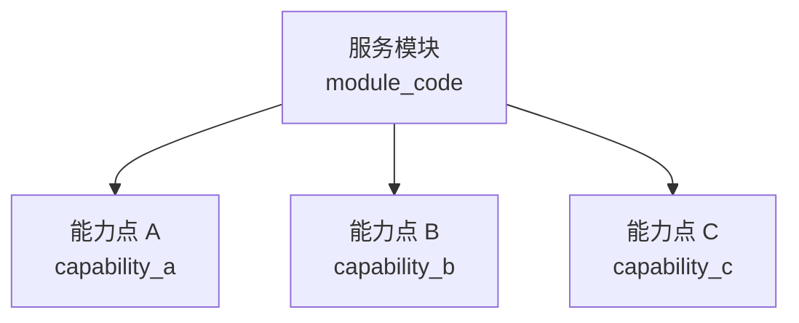

# 【PRD】租户服务配置 2.0

## 文档导读

本文定义健康管理平台多租户场景下“模块配置”的产品目标、业务边界、核心概念和建设范围。

模块配置不是菜单开关，也不是角色权限体系。它是 M 端面向租户的底层能力配置，用于管理需要租户差异化配置、需要跨端联动关闭的业务能力。配置发布后，B 端、C 端和后端服务按同一套能力点编码控制可见性和可用性，避免多端重复配置和业务链路不一致。

本文面向产品、研发、测试、实施和运营协作，用于对齐建设口径。

# 1. 需求概述

## 1.1 业务背景

健康管理平台是多租户平台。平台具备完整业务能力，但不同租户因采购范围、业务形态、实施阶段和运营策略不同，实际开放的功能并不一致。

因此，平台需要支持按租户配置可用功能，让不同租户在同一套系统中拥有不同的功能范围。

## 1.2 效果概述

模块配置上线后，平台人员在 M 端为某个租户开启或关闭一项业务能力，系统应自动联动相关 B 端入口、C 端入口、后端接口、任务和消息能力，不需要在多个端侧或多个页面中重复配置。

以“服务包模块”为例，关闭该模块后，系统应同步处理以下范围：

| 影响范围 | 预期表现 |
| --- | --- |
| B 端 | 服务包管理、订单管理等服务相关入口不可见或不可用 |
| C 端 | 服务入口、订单入口、订阅入口等不可见或不可用 |
| 后端服务 | 服务包相关查询、创建、更新、生成等接口不可用 |
| 任务与消息 | 服务包相关任务、通知和跳转消息不再触发 |

系统需要避免出现以下状态：

- 某个端侧已经关闭，另一个端侧仍然可见。
- 前端入口已经隐藏，但后端接口仍可调用。
- 菜单已经不可见，但用户通过历史链接仍能访问。
- 同一业务能力需要在多个位置分别维护开关。

## 1.3 能力配置与角色权限边界

模块配置回答：

> 这个租户有没有这个功能？

角色权限回答：

> 在租户已拥有该功能的前提下，某个用户能不能查看、创建、编辑、删除或审批？

租户未启用某功能时，即使用户角色拥有权限，也不可见、不可用。具体可见、可用判断规则见“3.3 与端侧权限点的关系”。

# 2. 建设目标与原则

## 2.1 核心目标

- 支持平台为不同租户配置不同的业务能力。
- 支持一个业务模块关闭后，B 端、C 端、后端接口、任务和消息统一生效。
- 支持父子层级校验，避免能力点在上级服务模块关闭时仍然生效。

## 2.2 产品原则

- **按业务能力配置，不按页面配置**：配置对象是业务能力，不是某个菜单、页面或按钮。
- **一处配置，多端生效**：M 端配置租户业务能力，B 端、C 端和后端统一按能力点编码控制可见与可用。
- **轻量能力中心优先**：不建设完整商业 Feature Flag 平台，而是建设轻量的租户功能能力中心。
- **后端校验必须存在**：前端隐藏只改善体验，不能作为安全边界。
- **历史数据默认保留**：模块关闭不等于删除历史数据。

## 2.3 纳入范围

纳入范围遵循以下原则：

- 不把模块配置建设成全量功能目录。
- 只纳入需要租户差异化配置、需要跨端联动关闭的业务能力。
- 不能关闭的核心必选功能不纳入模块配置清单。

# 3. 产品概念模型

## 3.1 概念定义

模块配置由两类实体组成：

| 概念 | 说明 | 示例 |
| --- | --- | --- |
| 服务模块 | 一组业务能力的上层归类，用于控制该业务域是否整体开放 | 服务包模块 |
| 能力点 | 服务模块下的具体可控能力，用于控制某一类业务功能是否开放 | 服务包管理、订单管理、订阅管理 |

服务模块和能力点是上下级关系，不是端侧页面关系。

在服务业务场景中，“服务包模块”是一个服务模块实体；“服务包管理”是服务包模块下的一项能力点，不等同于服务包模块本身。

能力点编码是能力点的稳定标识，用于将能力点与端侧权限点关联。端侧权限点属于端侧 RBAC 权限体系，不属于模块配置实体。

## 3.2 层级结构与生效规则

服务模块可以按父子层级组织：父级模块控制一组业务能力是否整体开放，能力点控制该业务域下的具体能力。



生效规则：

```text
关闭父级业务模块
-> 其下属能力点整体不可用

开启父级业务模块，但关闭某个能力点
-> 该能力点相关功能不可用
-> 其他已开启的能力点仍可按配置使用
```

服务业务示例：

```text
服务包模块
- B 端服务包管理
- B 端订单管理
- C 端订单入口
- C 端订单管理
- C 端订阅
```

含义说明：

- 服务包模块：用于批量控制服务包相关能力点，本身不对应端侧权限点。
- B 端服务包管理：服务包模块下的具体能力点，用于控制 B 端服务包配置与管理功能。
- B 端订单管理：服务包模块下的具体能力点，用于控制 B 端服务包订单管理功能。
- C 端订单入口：服务包模块下的具体能力点，用于控制 C 端服务包订单入口。
- C 端订单管理：服务包模块下的具体能力点，用于控制 C 端服务包订单列表和详情。
- C 端订阅：服务包模块下的具体能力点，用于控制 C 端订阅入口和订阅记录。

当前模型只处理父子层级关系，不处理跨模块依赖、互斥、组合启用等复杂规则。

## 3.3 与端侧权限点的关系

服务模块不替代 B 端、C 端的功能权限体系。端侧权限点仍然描述具体入口、页面、操作和接口；服务模块通过能力点编码对端侧权限点形成上层约束。

能力点可以对应页面、入口、按钮、接口、任务或消息等实际功能控制点，但一个能力点只绑定一个端侧权限点 key。涉及多端或多个端侧节点时，应拆分为多个能力点平铺维护。

端侧权限点应绑定到最匹配的能力点编码。以下为服务业务场景示例：

```text
B 端服务包管理 -> service_package_manage
B 端订单管理 -> b_service_order_manage
C 端订单入口 -> c_service_order_entry
C 端订单列表页 -> c_service_order_list
C 端订阅入口 -> c_service_subscription
```

端侧权限点是否可见或可用，按以下规则判断：

```text
端侧节点是否可见/可用 =
租户启用了该节点绑定的能力点
AND 该能力点的上级服务模块已启用
AND 用户角色拥有该节点权限
```

因此，服务模块回答“租户有没有该业务能力”，端侧功能权限回答“用户能不能使用具体入口或操作”。关闭服务模块或其能力点后，绑定到对应能力点编码的端侧权限点同步不可见或不可用。

# 4. 功能说明

## 4.1 页面说明

模块配置页面用于平台人员按租户配置服务模块及其下属能力点。

模块配置按租户维度生效。页面从租户管理列表进入，当前选中的租户即为本次配置对象。页面顶部展示当前租户名称，用于确认配置作用范围。

本页面只维护租户是否启用某项服务模块或能力点，不维护端侧角色权限。

## 4.2 页面信息

页面以表格形式展示配置项。

表格按服务模块组织能力点。服务模块与其第一个能力点展示在同一行；同一服务模块下的后续能力点行，不重复展示服务模块名称。

表格字段包括：

| 字段 | 说明 |
| --- | --- |
| 服务模块 | 服务模块名称，表示一组业务能力的上层归类 |
| 能力点 | 服务模块下的具体可配置能力 |
| 能力点 key | 能力点的稳定编码，用于租户能力配置识别 |
| 对应权限点 key | 端侧权限树中的节点 key，用于关联实际受控功能 |
| 说明 | 对能力点控制范围的简要说明 |

## 4.3 交互规则

- 服务模块列提供父级复选框。
- 能力点列提供子级复选框。
- 勾选服务模块时，该服务模块下所有能力点同步勾选。
- 取消勾选服务模块时，该服务模块下所有能力点同步取消。
- 当服务模块下能力点全部勾选时，服务模块显示为已勾选。
- 当服务模块下能力点部分勾选时，服务模块显示为半选状态。
- 当服务模块下能力点全部取消时，服务模块显示为未勾选。

## 4.4 能力点与权限点规则

- 一个能力点只对应一个能力点 key。
- 一个能力点只对应一个端侧权限点 key。
- 涉及多端的业务能力，需要拆分为多个能力点平铺展示。
- 例如同一个服务包能力影响 B 端订单管理、C 端订单入口、C 端订单管理时，应拆分为多个能力点分别配置。
- 入口类权限点使用 `Entry` 命名。
- 页面类权限点使用 `Page` 命名。
- 按钮类权限点使用 `Button` 命名。

## 4.5 生效与保存规则

- 点击保存后，提交当前租户的模块配置结果。
- 保存成功后给出成功反馈。
- 租户未启用某能力点时，该能力点绑定的端侧权限点不可见或不可用。
- 即使用户角色拥有端侧权限，只要租户未启用对应能力点，该功能仍不可见或不可用。
- 端侧最终可见 / 可用判断为：服务模块启用 + 能力点启用 + 用户角色权限具备。
- 前端隐藏只作为体验控制，后端仍需按能力点进行可用性校验。
